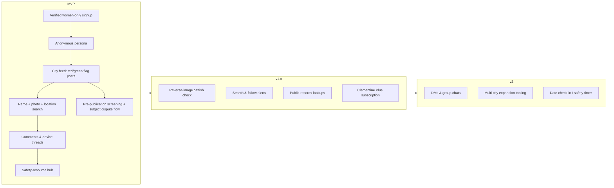

# Clementine — Product Specification

**Document:** 01-product-spec.md · **Status:** Draft v1.0 · **Audience:** Founding team, advisors, early hires
**Related docs:** [02-architecture.md](02-architecture.md) · [03-data-model.md](03-data-model.md) · [04-api-design.md](04-api-design.md) · [05-trust-and-safety.md](05-trust-and-safety.md) · [06-security-and-privacy.md](06-security-and-privacy.md) · [07-ux-flows.md](07-ux-flows.md) · [08-roadmap.md](08-roadmap.md)

---

## 1. Vision and Positioning

**Clementine is a verified, women-only safety network for dating.** Members anonymously share experiences about men they have dated or matched with, look up a prospective date before meeting him, and get alerted when new information surfaces about someone they're seeing — all inside a community that is moderated, legally careful, and engineered so that a data breach cannot expose the women who trust it.

The category was proven by Tea Dating Advice, which hit #1 on the US App Store in July 2025. Tea also proved the category's two failure modes: **legal exposure** (defamation and doxxing claims from men named in posts) and **catastrophic security failure** (a public storage bucket leaking ~72,000 images including ~13,000 verification selfies and IDs, followed by a leak of ~1.1M private messages). Clementine's positioning is direct: *the same protective value, built by people who assumed from day one that the app would be breached, subpoenaed, and sued — and designed so that none of those events destroys its users.*

**Positioning statement:** For women who date men and want to vet them before meeting, Clementine is a verified anonymous community that surfaces safety-relevant history and public records — unlike Facebook's "Are We Dating the Same Guy?" groups (unsearchable, unmoderated, bannable overnight) and unlike Tea (breached, litigation-magnet), Clementine pairs community intelligence with pre-publication screening, a fair dispute process for post subjects, and a delete-by-default approach to sensitive data.

**Brand principles:**

1. **Safety over virality.** We will slow a feature down (screening queues, verification gates) if speed creates risk for a member or a post subject.
2. **Anonymity with accountability.** Members are anonymous to each other, never to our abuse-prevention systems.
3. **Facts age better than accusations.** Product surfaces push members toward specific, dated, first-person experience reports rather than character verdicts.
4. **The subject is a stakeholder.** Men described in posts get notice, dispute, and takedown rights (detailed in [05-trust-and-safety.md](05-trust-and-safety.md)). This is both an ethical stance and our primary defamation-risk control.

## 2. The Problem

Dating apps moved courtship to platforms where identity is cheap to fake and history is invisible. Concretely:

- **Information asymmetry.** A woman meeting a match knows only what he chose to show. Married men, men with restraining orders, men with patterns of coercive behavior, and registered sex offenders present identical profiles to first-time daters.
- **Catfishing and romance scams.** Stolen photos and fabricated identities drive both emotional harm and financial fraud; individual users have no practical way to reverse-search a profile photo mid-swipe.
- **Whisper networks don't scale.** The information women need usually *exists* — in friend groups, in 50,000-member Facebook AWDTSG groups — but it is unsearchable, geographically fragmented, and hosted on platforms that can delete a group without notice.
- **Dating platforms under-invest in safety.** Background checks (e.g., Match Group's Garbo partnership) have been bolt-ons, sometimes discontinued, and never cover the "he's married" / "he love-bombed then stalked me" class of information that only lived experience captures.
- **Existing solutions burned trust.** Tea demonstrated demand and then demonstrated what happens when verification IDs sit in a public bucket. The market now contains millions of women who want this product and have concrete reasons to distrust it.

The job to be done: *"Before I invest time or put myself in a room with this man, tell me what other women already know — and don't create a new way for me to get hurt in the process."*

## 3. Personas

### Persona 1 — "Maya," 27, active online dater (core member)

Product manager in Chicago; on 2–3 dating apps; 3–5 new matches a week. Was catfished once and once discovered a long-term match was engaged. She screenshots profiles into a group chat asking "anyone know him?"
**Needs:** fast lookup of a first name + photo + neighborhood before a first date; reverse-image check on suspicious profiles; alerts if someone she's currently seeing gets a new report.
**Success looks like:** lookup takes under a minute and she trusts a "no results" answer to actually mean no reports exist in her metro.

### Persona 2 — "Denise," 41, divorced re-entrant (safety-first subscriber)

School administrator in suburban Atlanta, two kids, dating again after 12 years. Less fluent in app-dating norms, more alarmed by them; higher willingness to pay for peace of mind.
**Needs:** structured background signal (sex-offender registry, criminal-records, marriage-records lookups); plain-language safety guides; a community where asking "is this normal?" isn't embarrassing.
**Success looks like:** she runs a records check and reads community advice before every first date, and the premium subscription feels like insurance she's glad to pay for.

### Persona 3 — "Priya," 33, community contributor and lurker-guardian (power user / moderator pipeline)

Nurse in Austin; long-time AWDTSG group member who has written detailed warnings that got other women out of bad situations. Frustrated that Facebook posts vanish, can't be searched, and expose her real name to mutual friends.
**Needs:** true anonymity from other members; assurance that a detailed, factual post won't get her sued or doxxed in retaliation; visible evidence that moderation removes revenge posts and misuse.
**Success looks like:** her reports are found by searchers months later; she becomes a volunteer moderator. Priya-types are the supply side of the marketplace — the product must earn their trust hardest.

## 4. Competitive Landscape

| | **Tea Dating Advice** | **Garbo** | **Lulu** (defunct) | **AWDTSG Facebook groups** | **Dating-app native safety** (Tinder/Bumble/Hinge) | **Clementine** |
|---|---|---|---|---|---|---|
| Model | Anonymous women-only app: posts, lookups, records checks | Nonprofit background-check tool (was integrated with Match Group) | Numeric ratings + hashtag reviews of men, tied to Facebook | City-based private Facebook groups, volunteer admins | Photo verification, panic/share-my-date tools, some ID checks | Verified anonymous community + records lookups + fair-process moderation |
| Community reports (lived experience) | Yes — core | No | Yes (ratings, not narratives) | Yes — core | No | Yes — core, with pre-publication screening |
| Searchable history by name/photo/location | Yes | Name/records only | Yes (while live) | No (manual scroll/ask) | No | Yes |
| Reverse-image / catfish check | Yes | No | No | No | Partial (verifies own users only) | Yes |
| Public-records checks | Yes | Yes — core | No | No | Briefly (Garbo deal, ended) | Yes (premium) |
| Women-only verification | Yes (selfie/ID) | N/A | Facebook-gender based | Admin vetting, inconsistent | N/A | Yes — verify-then-delete media policy |
| Subject notice / dispute process | Weak | N/A (records are public) | No — a core criticism | No — a core legal criticism (class actions filed) | N/A | **Yes — differentiator** |
| Doxxing controls | Post rules, inconsistent | N/A | No | Admin-dependent | N/A | Automated pre-publication screening blocks addresses, workplaces, phones, socials |
| Security track record | 2025 breach: ~72k images incl. ~13k IDs/selfies; ~1.1M DMs leaked | No known major breach | Shut down 2016 (model + consent backlash) | Facebook-grade, but group bans lose everything | Mixed | Designed breach-first: see [06-security-and-privacy.md](06-security-and-privacy.md) |
| Key lesson for us | Demand is enormous; security and legal design are existential | Records alone lack the lived-experience layer | Rating men like products invites backlash and legal risk | Unstructured community intelligence doesn't scale or survive platform risk | Platforms won't build this; they carry liability aversion | — |

**Strategic takeaways:** (1) The winning product combines Garbo's records layer with AWDTSG's community layer, which only Tea has done — the category leader position is genuinely contestable on trust. (2) Lulu's failure warns against gamified scoring of men; Clementine uses structured factual flags, not ratings out of ten. (3) AWDTSG's litigation (defamation class actions naming group members) is the roadmap of what our screening and dispute process must prevent.

## 5. Feature Catalog

Features are tiered: **MVP** (launch), **v1.x** (fast-follow, first ~2 quarters), **v2** (expansion). Sequencing detail lives in [08-roadmap.md](08-roadmap.md); interaction detail in [07-ux-flows.md](07-ux-flows.md).

### 5.1 MVP — the trustworthy core

**Verified women-only signup.** A new member submits a short video selfie (liveness-checked) during onboarding; an automated gender/age estimate plus human review on low-confidence cases grants access, typically within hours. Government ID is requested *only* if selfie review is inconclusive or for appeal of a rejection. From the user's perspective: one guided capture screen, a "we're reviewing" state, and a clear promise displayed at capture time — **"your selfie is used once for verification and then deleted."** Per the Tea-breach mandate, verification media is purged within 24 hours of decision (or immediately on approval where law permits) and never retained more than 7 days from capture, never lands in general-purpose storage, and is encrypted in the interim; only outcome metadata survives, and only for 1 year ([06-security-and-privacy.md](06-security-and-privacy.md), [03-data-model.md](03-data-model.md)).

**Anonymous persona.** After verification, the member picks a display name and avatar with no linkage to her legal identity visible anywhere in-product. Real names, contact info, and verification artifacts are never shown to other members. Internally, persona ↔ account linkage exists solely for abuse enforcement and legal process ([03-data-model.md](03-data-model.md)).

**City-based feeds with red-flag / green-flag posts.** The home surface is the member's metro feed. A post is a structured object, not free text alone: subject's first name, approximate age, neighborhood/city, one or more photos of him (from dating profiles or public social media), a **red flag** (safety concern: e.g., "married," "aggressive when rejected," "asked for money") or **green flag** (positive report: "respectful, who he says he is"), and a first-person narrative. Composer guidance nudges toward specific, dated, first-hand statements ("On our second date in March he…") and away from conclusory labels — a deliberate defamation-surface reduction. Users can filter the feed by flag type, recency, and neighborhood.

**Pre-publication screening (invisible when it works, load-bearing always).** Every post and comment passes an automated screen *before* going live: doxxing patterns (street addresses, employer names, phone numbers, emails, social handles, license plates) are blocked outright with an inline explanation of what to remove; likely-defamatory framings, threats, and minors' involvement route to a human moderation queue. From the poster's perspective this is a brief "reviewing your post" state, usually seconds, occasionally minutes. Full policy in [05-trust-and-safety.md](05-trust-and-safety.md).

**Search: first name + photo + location.** The search screen accepts any combination of first name, uploaded photo, and location, and returns matching subject profiles — each an aggregation of every post about (apparently) the same man, with flag summary and post timeline. Photo matching runs against images previously attached to posts. A prominent empty state says what "no results" does and does not mean ("no reports in this area — not a guarantee"). Search requires membership; there is no public/unauthenticated search, and results are not indexable by search engines.

**Comments and advice threads.** Members comment on posts ("him too — DM details" is disallowed pre-DM-launch; screening applies to comments identically). A separate **Advice** feed hosts subject-free discussion threads ("how do I ask about his divorce?"), giving the community a growth surface with near-zero defamation exposure.

**Subject notice, dispute, and takedown.** A man who believes he is the subject of a post can, from a public web page (no app install), submit an identity-verified dispute: he proves he is the person depicted (selfie match against the posted photo, handled with the same verify-then-delete media policy), and can flag a post as false, doxxing, or about the wrong person. Disputes route to trained moderators with defined SLAs; outcomes include removal, redaction, annotation, or upholding with rationale. This flow ships **at MVP**, not later — it is the legal keel of the product. Details and appeal ladder: [05-trust-and-safety.md](05-trust-and-safety.md).

**Safety-resource hub.** A static-fast section with hotlines (DV, sexual assault, human trafficking), state-by-state guidance (restraining orders, police reporting), safe-first-date checklists, and romance-scam education. Free forever, accessible pre-verification — it must never sit behind the paywall or the verification gate.

### 5.2 v1.x — intelligence and revenue

**Reverse-image catfish check.** A member uploads a screenshot of a dating profile photo; Clementine searches the open web and its own report corpus for other appearances of that image. Results show where else the photo appears ("this photo appears on a stock-model portfolio / an Instagram belonging to a different name"), with a match-confidence indicator. Free members get a limited number of checks per month; Plus members get more (see §6). Backed by a third-party reverse-image API at launch ([02-architecture.md](02-architecture.md)).

**Search-and-follow alerts.** After searching a man or viewing his subject profile, a member can **follow** him. If a new post, comment, or dispute-outcome annotation lands on that subject, she gets a push notification: "New activity on someone you follow." Past searches can be re-run automatically ("notify me if a report ever appears for this search"). This converts one-time lookups into retention and is a headline Plus feature (free tier: limited follows).

**Public-records lookups.** From a subject profile or a standalone tool, a member runs a records check on a name + state (+ approximate age): **sex-offender registry** hits, **criminal-records** results, and **marriage-records** results where available, via licensed data providers. Results render with mandatory context framing: records are jurisdiction-dependent, incomplete, may concern a same-named different person, and **must not be used for employment, housing, credit, or insurance decisions** — Clementine is not a consumer reporting agency, and product copy, rate limits, and ToS are all built to keep us outside FCRA scope ([05-trust-and-safety.md](05-trust-and-safety.md), [06-security-and-privacy.md](06-security-and-privacy.md)). Records lookups are the anchor Plus feature, with a small metered free allowance.

**Clementine Plus** launches in this phase — see §6.

### 5.3 v2 — communication and expansion

**DMs and group chats.** One-to-one DMs (e.g., two women comparing notes about the same man) and small group chats. Deliberately deferred to v2 because Tea's second breach was its DM archive: our messaging ships only with end-to-end encryption, client-held keys, aggressive default message expiry (90 days), and user-controlled deletion — the design assumption is that a full server compromise yields no readable message bodies ([02-architecture.md](02-architecture.md), [06-security-and-privacy.md](06-security-and-privacy.md)). In-product safety: DM requests are gated, screenshot-deterrence notices apply, and in-DM abuse is reportable with message-level evidence forwarding.

**Multi-city expansion tooling.** Founding-member programs for new metros, city-level moderator recruitment (the Priya pipeline), and feed bootstrapping so a new city isn't an empty room. Burst-growth readiness (Tea went from niche to #1 in days) is an architecture requirement ([02-architecture.md](02-architecture.md)) and a T&S staffing plan ([05-trust-and-safety.md](05-trust-and-safety.md)), not just marketing.

**Date check-in / safety timer.** A member logs "meeting Tom, 7pm, Bar X," designates trusted contacts, and checks in when home; a missed check-in pings her contacts with the date details she pre-approved. High trust value, low legal risk, strong Plus differentiator.

**Deliberately *not* in any tier:** see §8 Non-Goals.

## 6. Monetization

Freemium subscription. The free tier must remain genuinely protective — degrading core safety for revenue would poison the community that produces our content. Contribution (posting, commenting, moderating) is never paywalled, because posts are the supply side.

| Capability | Free | **Clementine Plus** (~$14.99/mo or ~$99/yr; intro pricing tested at launch) |
|---|---|---|
| Verified membership, anonymous persona | ✓ | ✓ |
| City feed, posting, comments, advice threads | ✓ | ✓ |
| Safety-resource hub | ✓ (no account needed) | ✓ |
| Name/photo/location search | 5 searches/day | Unlimited |
| Reverse-image catfish checks | 2/month | 20/month |
| Public-records lookups (registry, criminal, marriage) | 1 basic check/month | Bundled monthly allowance + discounted additional checks |
| Follows + new-report alerts | 3 active follows | Unlimited, plus saved-search alerts |
| Date check-in / safety timer (v2) | Basic | Full (multiple contacts, recurring) |
| Early access to new metros/features | — | ✓ |

**Revenue mechanics and guardrails:**

- Records lookups have per-unit data-provider costs; the Plus allowance is sized so the marginal subscriber is profitable, with overage packs rather than unlimited checks.
- **No advertising** in the foreseeable product: ads against posts about named men is a brand and legal hazard, and ad-tech SDKs conflict with our data-minimization posture.
- **We never sell or share member data** — this is a published commitment, load-bearing for trust and for GDPR/CCPA posture ([06-security-and-privacy.md](06-security-and-privacy.md)).
- No pay-to-remove: subjects' takedown/dispute rights are free and revenue-isolated; charging men for removal is reputation-extortion territory and is permanently out of scope.
- Conversion thesis: free members hit the search/alert caps precisely when they are most engaged (actively vetting someone), making the upgrade moment organic. Target 5–8% free→paid conversion at maturity.

## 7. Success Metrics

**North-star metric: Weekly Protective Actions (WPA)** — count of searches, records checks, reverse-image checks, alert receipts, and resource-hub reads per week. It measures delivered safety value, is hard to inflate with engagement-bait, and correlates with conversion.

| Area | Metric | Early target (first 2–3 metros, ~6 months post-launch) |
|---|---|---|
| Acquisition | Verified signups/week; verification completion rate | ≥70% of started verifications complete |
| Verification integrity | Median review time; false-accept rate (audited) | <12h median; false-accepts <0.5% on audit sample |
| Activation | % of new members performing a protective action in week 1 | ≥60% |
| Engagement | WAU/MAU; WPA per WAU | WAU/MAU ≥45% |
| Supply | Posts per metro per week; % searches returning ≥1 result | ≥30% search hit-rate in mature metros |
| Retention | W4 retention of verified members | ≥35% |
| Revenue | Free→Plus conversion; Plus monthly churn | 5–8% conversion; <6% churn |
| **Trust & safety (co-equal with growth)** | Screening precision/recall on doxxing; median dispute resolution time; % posts removed post-publication (want *low* — screening should catch pre-publication); substantiated doxxing incidents reaching publication | Dispute SLA ≤72h; published-then-removed <3% of posts; doxxing publications → 0 |
| Security | Verification-media retention compliance (audited); time-to-detect on canary access | 100% deletion-SLA compliance |

Counter-metrics we watch to avoid perverse incentives: red-flag/green-flag ratio (an all-accusation feed indicates culture drift), dispute *upheld-against-post* rate (rising = screening failing), and time-in-app (we do not optimize for it; a safety tool should be efficient, not sticky-for-stickiness).

## 8. Non-Goals

Explicitly out of scope — decided, not deferred:

1. **Not a dating app.** No matching, no profiles of members for romantic discovery, no swiping. We vet dates; we don't create them.
2. **No men's version, no "all genders" pivot.** The protective asymmetry this product addresses is specific; a mirrored product for reviewing women has a different (and darker) risk profile. Signup remains women-only; subjects' rights are served by the dispute flow, not by membership.
3. **No numeric ratings or scores of men.** Lulu's lesson. Structured flags plus narratives, never "7/10."
4. **No employment/tenant/insurance screening use.** We are not a consumer reporting agency and will actively prevent FCRA-scope use (§5.2).
5. **No public, logged-out search or SEO-indexed subject pages.** Reports are for verified members, not for making any man's name Googleable via Clementine. This is simultaneously a legal, ethical, and virality-restraint decision. The sole exception is the verified-subject portal ([05-trust-and-safety.md](05-trust-and-safety.md) §4): a subject can learn whether content about him exists only *after* passing ID + liveness verification — pre-verification lookups return only a neutral "we will check and respond" acknowledgment, never a match signal.
6. **No real-identity social graph.** No contact-book import for finding friends, no "X friends are on Clementine." Anonymity is the product.
7. **No data monetization, no ad network SDKs** (§6).
8. **No user-run background checks on non-dating contexts** as a marketed use case (neighbors, coworkers); product copy and flows frame every lookup in dating-safety terms.
9. **No pay-for-removal or reputation-management services for subjects.**
10. **No AI-generated "summaries of a man"** that synthesize a verdict across posts. Search results present sourced posts and records verbatim with context; the judgment belongs to the member. (Automated *screening* of content is in scope; automated *characterization* of people is not.)

---

*Next: [02-architecture.md](02-architecture.md) turns these requirements — burst-scale feeds, verify-then-delete media handling, breach-assuming DM design — into a system design.*
