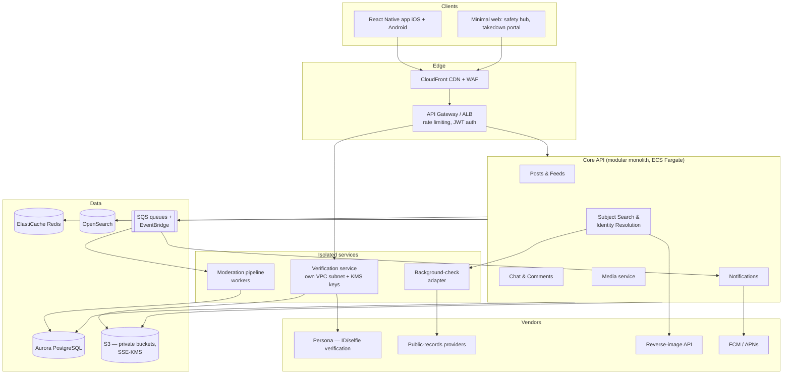
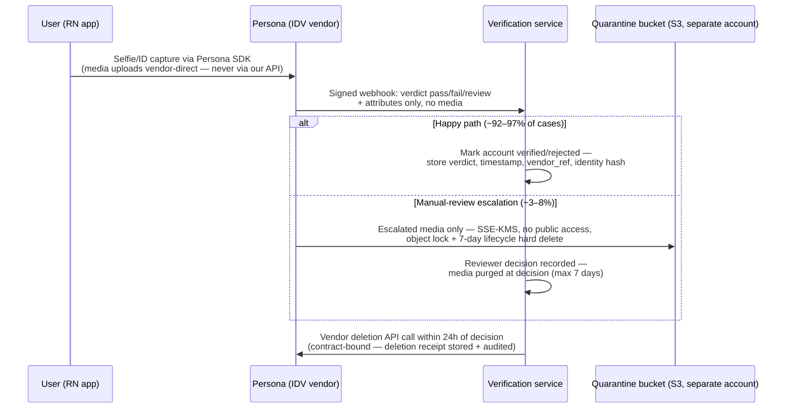

# Clementine — System Architecture

This document defines the technical architecture for Clementine, a women-first dating-safety app. It is designed for a 4–6 person team, mobile-first delivery, and the possibility of a Tea-style overnight viral spike (Tea hit #1 on the US App Store in July 2025). Product requirements are in [01-product-spec.md](01-product-spec.md); the schema behind these services is in [03-data-model.md](03-data-model.md); API contracts in [04-api-design.md](04-api-design.md); moderation policy in [05-trust-and-safety.md](05-trust-and-safety.md); and the security controls referenced throughout are specified in [06-security-and-privacy.md](06-security-and-privacy.md).

## Architecture principles

1. **Assume breach, minimize blast radius.** Tea's 2025 incident — verification selfies and IDs sitting in a publicly readable Firebase bucket, then ~1.1M DMs leaked — is our design floor, not a cautionary footnote. Verification media is deleted after review (or held encrypted under strict retention), no storage bucket is ever publicly listable, and DM bodies are end-to-end encrypted so that even a full server compromise yields only ciphertext.
2. **Modular monolith first, services where risk demands it.** A 4–6 person team cannot operate 10 microservices well. We run one well-modularized core API, and carve out only the components with a distinct security boundary or failure profile: identity verification, the moderation pipeline, and the background-check adapter.
3. **Everything user-facing must degrade gracefully under load.** Viral growth arrives in hours. Queues buffer the expensive asynchronous work (verification, moderation, notifications); the synchronous path is thin, cached, and horizontally scalable.
4. **Compliance is architectural.** Pre-publication screening, subject takedown flows, and GDPR/CCPA deletion (including for non-user subjects) require specific data paths — they are built into the moderation pipeline and data model, not bolted on.

## High-level architecture

## Client strategy: React Native

**Recommendation: React Native (with Expo) for iOS and Android, plus a small web property.**

Rationale for a 4–6 person team:

- **One codebase, two stores.** Clementine's UI is feeds, forms, chat, and search — CRUD-heavy screens with no demanding graphics or low-latency native needs. This is React Native's sweet spot; a shared TypeScript stack across app and backend also lets any engineer work anywhere.
- **Burst-friendly release velocity.** Expo EAS Update lets us ship JS-level fixes over the air without App Store review — critical when a viral spike surfaces bugs and moderation gaps in real time.
- **Native modules where needed.** Camera capture for verification selfies and push handling use mature RN libraries; Persona ships an official React Native SDK, so the one flow that most needs native polish is vendor-provided.

Native Swift/Kotlin would buy marginal polish at roughly double the client engineering cost — the wrong trade until the team grows. The web property stays deliberately thin: the public safety-resource hub and the **subject takedown/dispute portal** (see [05-trust-and-safety.md](05-trust-and-safety.md)) must be reachable by men who are not and never will be app users, so it lives on the web, not in the app.

## Backend service decomposition

The core API is a **TypeScript (NestJS) modular monolith** — modules with enforced boundaries, deployable as one unit, splittable later along module seams. Three components run as separate services from day one because they need isolation, not because of scale.

| Component | Deployed as | Why |
|---|---|---|
| Auth & sessions | Core module | Standard OIDC/JWT; sessions in Redis |
| **Verification service** | **Separate service** | Handles the most dangerous data (selfies/IDs). Own subnet, own KMS keys, own narrowly-scoped IAM role. The core API can ask "is user X verified?" but can never touch verification media. |
| Posts & feeds | Core module | City-scoped feeds, red/green-flag posts; read-heavy, cache-friendly |
| Subject search & identity resolution | Core module | Resolves (first name + photo + location) queries against subject profiles; fans out to OpenSearch and the image-matching index; records search subscriptions for alerting |
| Media | Core module | Presigned S3 uploads, EXIF stripping, thumbnailing via Lambda; all delivery through CloudFront **signed URLs** — no public objects, ever |
| Notifications | Core module + workers | Consumes domain events (new report on a followed subject) from SQS; delivers via FCM/APNs |
| **Moderation pipeline** | **Separate workers** | Every post/comment/image passes through it *before publication*: PII/doxxing detection (addresses, phone numbers, workplaces, social handles), image nudity/abuse classification, defamation-risk heuristics, then human review queues. Async by design; must be able to lag without taking the API down. |
| **Background-check adapter** | **Separate service** | Wraps sex-offender registry, criminal-records, and marriage-records vendors behind one internal API. Isolates vendor credentials, normalizes responses, caches results, and centralizes FCRA/DSA-style compliance logging. Vendors can be swapped without touching product code. |
| Chat (DMs, group chats) | Core module + WebSocket gateway | WebSockets over ALB; Redis pub/sub for fan-out. Message bodies are end-to-end encrypted on-device — Signal protocol via libsignal for 1:1 DMs at DM launch, MLS for group chats when they ship — with message franking so user-filed abuse reports remain verifiable. The server relays and stores only ciphertext it cannot decrypt ([06-security-and-privacy.md](06-security-and-privacy.md) §6). |

### The verification path (the lesson from Tea, made concrete)

In the happy path verification media never touches Clementine's infrastructure at all — it goes client-to-vendor, and the vendor's copy is destroyed by a contract-mandatory deletion API call within 24 hours of the decision. Only manual-review escalations land in the quarantine bucket, on a 7-day lifecycle fuse ([06-security-and-privacy.md](06-security-and-privacy.md) §3). The surviving record is a verdict, a vendor reference, and a deletion receipt, retained 1 year ([03-data-model.md](03-data-model.md)) — you cannot leak 13k selfies you no longer possess.

## Data stores and queues

| Store | Technology | Used for |
|---|---|---|
| Primary DB | **Aurora PostgreSQL** (Serverless v2 to start) | Users, personas, posts, subjects, reports, moderation cases, subscriptions. Postgres handles our relational core plus `pgvector` for early image-embedding lookups. Serverless v2 absorbs spiky load without capacity planning. |
| Cache & realtime | **ElastiCache Redis** | Sessions, feed caches, rate-limit counters, chat pub/sub, notification dedupe |
| Search | **OpenSearch** | Subject search (fuzzy first-name + location), post search; also the ANN index for photo similarity once pgvector outgrows itself |
| Object storage | **S3** | Post media, verification media (separate bucket + KMS key), exports. Account-level Block Public Access enforced; access only via signed URLs. |
| Queues/events | **SQS + EventBridge** | `post.submitted` → moderation; `report.published` → notifications; `subject.updated` → search reindex. Dead-letter queues on everything. SQS over Kafka: near-zero ops for a small team; revisit at sustained >5k events/sec. |
| Analytics | **S3 + Athena** (later a warehouse) | Event firehose for product analytics; keeps PII out of third-party analytics tools |

## Third-party vendors

**ID/selfie verification: Persona** (primary recommendation). Best-in-class configurable flows, an official React Native SDK, government-ID + selfie liveness matching, and — decisively — configurable **vendor-side retention/redaction schedules**, letting us enforce "delete after review" at the vendor too. Stripe Identity is the fallback (cheaper, simpler, fewer signal types); Onfido is strong but enterprise-priced. Cost ~$1–2/verification; verify once per account, not per session.

**Public records / background checks: aggregate, don't integrate one-by-one.** The adapter service composes: the **NSOPW/state sex-offender registries** (via a licensed data provider — direct scraping is fragile and legally fraught), a people-search/records aggregator for criminal and marriage records, and county-level sources through the same vendor. Vendor contracts must address the **FCRA line**: Clementine provides personal-safety lookups, not employment/tenancy screening, and the UI must state that clearly (details in [05-trust-and-safety.md](05-trust-and-safety.md) and [06-security-and-privacy.md](06-security-and-privacy.md)). Results are cached with short TTLs and never stored into subject profiles automatically.

**Reverse-image search: buy externally, build internally.**
- *External catfish detection* ("is this profile photo stolen from the open web?"): buy — **TinEye API** and/or Google Cloud Vision Web Detection. Building a web-scale crawler is a company in itself.
- *Internal matching* ("does this photo match a subject already reported here?"): build — perceptual hashes (pHash) plus CLIP-style embeddings in pgvector/OpenSearch. This is small, cheap, and is our differentiating index; no vendor has our corpus.

**Other vendors:** FCM/APNs (push), Stripe (premium subscriptions + App Store/Play billing), Twilio or SES (email/SMS), a CSAM-hash-matching service (required for any user media platform), and an ML moderation API (e.g., image/text classification) feeding the moderation pipeline.

## Infrastructure

- **Cloud: AWS**, single region (us-east-1) with multi-AZ everywhere; S3 cross-region replication and Aurora automated backups + PITR for DR. Multi-region active-active is deliberately deferred.
- **Compute: ECS Fargate.** Containers without cluster management — EKS's flexibility is not worth its operational tax at this team size. Lambda handles media processing and webhook glue.
- **IaC: Terraform**, one repo, per-environment workspaces (dev/staging/prod). Security-critical invariants — Block Public Access, KMS policies, IAM boundaries — are codified and enforced with policy checks (OPA/Conftest) in CI, so "someone misconfigured a bucket" fails the build rather than making the news.
- **CI/CD: GitHub Actions** — lint/test → build image → deploy to staging → manual gate → prod (rolling deploy with automatic rollback on health-check failure). Mobile builds/OTA via Expo EAS.
- **Observability:** OpenTelemetry throughout; Grafana Cloud (or Datadog if budget allows) for metrics/traces/logs; Sentry for client and server errors; PagerDuty for on-call. Golden signals dashboards per service plus two business-critical gauges: **moderation queue depth** and **verification backlog** — the first things to melt in a viral spike.

## Absorbing a viral burst

Tea went from obscurity to #1 on the App Store in days. The load pattern is specific: a flood of *signups* (verification-heavy), a flood of *searches*, and a modest rise in posts. The design responds layer by layer:

1. **Thin, stateless synchronous path.** Every API container is stateless; ECS scales on CPU/queue metrics from ~3 tasks to hundreds in minutes. Aurora Serverless v2 scales compute without a migration; read replicas serve feeds and search.
2. **Queues as shock absorbers.** Verification verdicts, moderation, notifications, and reindexing are all asynchronous. Under a 50x spike, queues deepen and processing lags gracefully — the app stays up, and users see honest status ("verification is taking longer than usual") rather than errors.
3. **The waitlist is load shedding.** Verification (vendor throughput + human review) is the true bottleneck — Tea ran a waitlist for exactly this reason. A feature-flagged admission-rate control turns signup pressure into a queue we drain at the pace moderation staffing allows. This is also a trust-and-safety control: it caps the growth rate of unmoderated content.
4. **Cache and CDN aggressively.** City feeds are cached in Redis with short TTLs; media is CDN-served with signed URLs; the safety hub is static. Search results for hot subjects are cached with event-based invalidation.
5. **Degradation ladder, pre-built.** Feature flags allow shedding in order: background-check lookups (vendor rate limits will force this anyway) → reverse-image external search → non-critical notifications → posting (read-only mode) — with sign-in and safety resources last to ever go dark.
6. **Protective edge.** WAF + per-IP and per-account rate limits at the gateway; virality attracts scrapers and hostile traffic (Tea's breach was discovered amid exactly that attention), so the edge assumes adversarial load from day one.

## Rough monthly infrastructure cost

Order-of-magnitude estimates (registered users; ~40% MAU; verification is one-time per user and dominated by growth rate, shown separately):

| Line item | 10k users | 500k users | 5M users |
|---|---|---|---|
| Compute (ECS, Lambda) | $300 | $4,000 | $25,000 |
| Aurora PostgreSQL | $200 | $3,500 | $20,000 |
| Redis + OpenSearch | $150 | $2,500 | $15,000 |
| S3 + CloudFront | $50 | $1,500 | $12,000 |
| SQS/EventBridge, misc AWS | $50 | $500 | $3,000 |
| Observability (Grafana/Sentry) | $100 | $1,500 | $8,000 |
| Push/email/SMS | $50 | $800 | $5,000 |
| **Subtotal, steady-state** | **~$900** | **~$14,300** | **~$88,000** |
| Verification (Persona, per *new* user) | ~$1.50 × signups | — | — |
| Background-check vendor (usage-based) | $500 | $10–25k | $75–200k |

Two takeaways: infra proper stays modest (~$0.02–0.09/user/month at scale — well under a premium subscription's margin), and **vendor costs, not AWS, are the scaling risk** — verification spend spikes exactly during viral growth (500k signups in a month ≈ $750k of verification), so the waitlist doubles as a financial throttle, and background-check quotas must be negotiated with burst tiers up front. Monetization coverage for these costs is modeled in [01-product-spec.md](01-product-spec.md).

## Open questions

- DM encryption is decided — E2E from DM launch (libsignal + message franking, per [06-security-and-privacy.md](06-security-and-privacy.md) §6; sequencing in [08-roadmap.md](08-roadmap.md)). Still open: MLS library maturity for group chats, and the multi-device / key-backup UX.
- Timing of the split of chat into its own service (WebSocket scaling profile differs from REST) — likely at the 500k tier.
- EU launch would force a second region and an EU data-residency story before anything else does.
