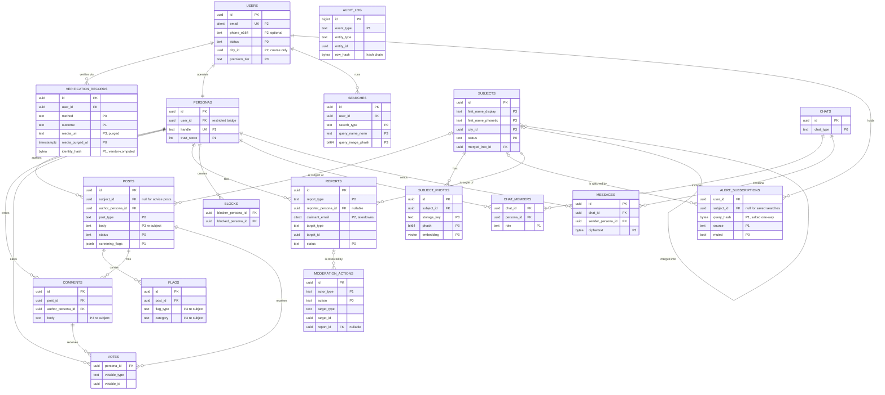

# Clementine — Data Model

This document defines the relational data model for Clementine's system of record (PostgreSQL, per [02-architecture.md](02-architecture.md)). It covers the ERD, table-by-table definitions, PII classification, retention and deletion policy, and indexing for the hot paths. API shapes over these tables live in [04-api-design.md](04-api-design.md); moderation workflows in [05-trust-and-safety.md](05-trust-and-safety.md); encryption, access control, and breach-hardening in [06-security-and-privacy.md](06-security-and-privacy.md).

## Design principles

1. **Identity is quarantined.** Real-world identity (`users`, `verification_records`) lives in a separate schema/service from community data (`personas`, `posts`, …). The single `personas.user_id` foreign key is the only bridge, and nothing on a content-serving path ever joins across it.
2. **Verification media is a liability, not an asset.** Selfies and ID documents are stored encrypted, in private buckets only, and purged on a hard deadline after review. This is the direct lesson of Tea's 2025 breach (public Firebase bucket, ~13k verification selfies/IDs exposed).
3. **Subjects are people with rights.** The men described in posts are data subjects under GDPR/CCPA even though they are not users. The model gives them a first-class entity so their data can be found, disputed, exported, and erased.
4. **Assume the DM store leaks.** Message content is ciphertext at rest; metadata is minimized (Tea's second leak was ~1.1M plaintext DMs).
5. **Deletable by default, holdable by exception.** Every table has an explicit retention rule and an account-deletion behavior; a `legal_holds` mechanism overrides deletion when litigation or law enforcement requires preservation.

## PII classification

Every column group below is tagged with one of four classes. Handling rules per class (encryption, access, logging) are defined in [06-security-and-privacy.md](06-security-and-privacy.md).

| Class | Meaning | Examples |
|---|---|---|
| **P0** | Non-personal / operational | Status enums, counters, timestamps on system events |
| **P1** | Pseudonymous — identifies a persona or internal ID, not a person directly | Persona handles, internal UUIDs, trust scores |
| **P2** | Personal data | Email, phone, coarse location, claimant contact info |
| **P3** | High-sensitivity | Verification selfies/IDs (biometric-adjacent), DM content, allegations about subjects, background-check results |

Note the asymmetry: a post's `body` is P1 with respect to its pseudonymous author but **P3 with respect to the subject** — it is an allegation about an identifiable non-user, potentially touching criminal-offense data (GDPR Art. 10). The stricter class governs.

## ERD



`AUDIT_LOG` is deliberately drawn without edges: it references entities by `(entity_type, entity_id)` without foreign keys so rows survive the deletion of what they describe.

## Identity & verification

### `users` — identity schema, restricted access

| Column | Type | PII | Notes |
|---|---|---|---|
| `id` | uuid PK | P1 | Never exposed in community APIs |
| `email` | citext UK | P2 | Login identifier |
| `phone_e164` | text UK null | P2 | Optional, for account recovery/2FA |
| `password_hash` | text | P2 | Argon2id; null if passkey-only |
| `status` | enum | P0 | `pending_verification` \| `active` \| `suspended` \| `deleted` |
| `verification_status` | enum | P1 | `unverified` \| `pending` \| `approved` \| `rejected` |
| `city_id` | uuid FK | P2 | Coarse home city from a reference `cities` table — **precise location is never stored** |
| `premium_tier`, `premium_expires_at` | enum, timestamptz | P0 | Freemium/premium (billing IDs live with the payment vendor, not here) |
| `is_over_18` | bool | P1 | Derived at verification; DOB and ID numbers are **not** persisted |
| `created_at`, `last_login_at`, `deleted_at` | timestamptz | P1 | `deleted_at` starts the 30-day purge clock |

### `verification_records`

One row per verification attempt (selfie liveness check and/or ID document, via a vetted vendor).

| Column | Type | PII | Notes |
|---|---|---|---|
| `id`, `user_id` | uuid | P1 | |
| `method` | enum | P0 | `selfie_liveness` \| `id_document` |
| `vendor`, `vendor_ref` | text | P1 | Opaque vendor transaction ID for dispute audit |
| `identity_hash` | bytea null | P1 | Vendor-computed, salted one-way hash of the document identity, returned in the verification webhook — used solely to block banned identities from re-verifying ([06](06-security-and-privacy.md) §3.4, ban-evasion ladder in [05](05-trust-and-safety.md) §3). The raw ID document number never reaches Clementine. Stored separately from persona data |
| `outcome`, `rejection_reason` | enum | P1 | |
| `media_uri` | text null | **P3** | Points into a private, KMS-encrypted, deny-by-default bucket. **No public buckets, ever** — enforced by infra policy tests ([06](06-security-and-privacy.md)) |
| `media_purged_at` | timestamptz | P0 | Set when media is destroyed; a scheduled job alerts if any row passes deadline unpurged |
| `reviewed_by`, `created_at`, `decided_at` | | P1 | `reviewed_by` = moderator ID or `auto` |

**Retention rule (non-negotiable):** media is purged within 24 hours of a decision, hard maximum 7 days from upload; only the outcome metadata survives. Every read of `media_uri` is written to `audit_log`. The same table (with `user_id` null and a link from `reports`) stores identity checks for takedown claimants.

### `personas`

The anonymous in-app identity created after approval. `user_id` is the sole identity↔community bridge; it is readable only by the account service and T&S tooling, never by feed/search/chat services.

Columns: `id` (P1), `user_id` FK (restricted), `handle` UK (P1, auto-generated, non-identifying, e.g. `AmberFox_2841`), `avatar_id` (P0, chosen from a preset illustration set — no photo uploads), `city_id` (P2), `trust_score` (P1, drives posting privileges per [05](05-trust-and-safety.md)), `status`, `created_at`.

## Subjects & identity resolution

### `subjects` — why first-class

A subject is the man a post is about. Modeling subjects as first-class rows — rather than free text inside posts — is what makes the product work *and* what makes it governable:

- **Aggregation:** search for "Ryan, 32, Austin" returns one subject with all linked posts and flag counts, not scattered text matches.
- **Alerting:** `alert_subscriptions` needs a stable ID to fan out "new report" pushes.
- **Dispute handling:** a takedown request, dispute status, or court order attaches to *one* entity and reaches all derived content.
- **Non-user rights:** GDPR/CCPA access and erasure requests from non-users are answerable only if their data is findable under a key.
- **Deduplication:** merge/split operations keep one canonical record per real person.

| Column | Type | PII | Notes |
|---|---|---|---|
| `id` | uuid PK | P1 | |
| `first_name_display` | text | P3 | First name only; the pre-publication screener blocks surnames, addresses, employers, phone numbers, and social handles ([05](05-trust-and-safety.md)) |
| `first_name_normalized` | text | P3 | Lowercased, diacritics stripped |
| `first_name_phonetic` | text | P3 | Double Metaphone, for match candidates |
| `age_range` | int4range null | P3 | e.g. `[30,35)` — never exact DOB |
| `city_id`, `geo` | uuid FK, geography null | P3 | City centroid only |
| `status` | enum | P0 | `active` \| `disputed` \| `suppressed` \| `merged` |
| `merged_into_id` | uuid FK null | P1 | Self-reference for merges |
| `suppression_hash` | bytea null | P1 | HMAC of normalized identity tuple, retained after erasure to block silent re-creation |
| `created_at`, `updated_at` | | P0 | |

**Identity resolution.** When a member starts a post, the client submits `(first_name, city, photo)`. The matcher scores candidates on phonetic-name match × city-radius proximity × photo pHash Hamming distance (and embedding cosine similarity), and shows the author a candidate list: "Is this the same Ryan?" Confirmation links the post to the existing subject; otherwise a new subject row is created. Matching is therefore **human-confirmed, machine-suggested** — we never silently assert two subjects are the same person. T&S can `merge` (repoint posts, tombstone the duplicate via `merged_into_id`) or `split` subjects; both are recorded as `moderation_actions` and in `audit_log`, since a wrong merge attaches allegations to the wrong man — the highest-severity data error this product can make.

### `subject_photos`

`id`, `subject_id` FK, `storage_key` (P3, private encrypted bucket, served only via short-lived signed URLs), `phash` bit(64) (P3), `embedding` vector (P3, general-purpose image embedding for reverse-image search — **not** a facial-recognition template; see biometric analysis in [06](06-security-and-privacy.md)), `uploaded_by_persona_id` (P1), `moderation_status`, `created_at`.

## Community content

### `posts`

| Column | Type | PII | Notes |
|---|---|---|---|
| `id`, `subject_id`, `author_persona_id` | uuid | P1 | Author is persona-keyed only; `subject_id` is **nullable** — null for advice posts |
| `post_type` | enum | P0 | `subject_report` \| `advice`. Advice posts are the subject-free discussion threads of [01](01-product-spec.md) §5.1 — public content, available at MVP, carrying no flags and no subject link, but running the same pre-publication screening pipeline and feed indexes as subject reports. They are **not** chats |
| `body` | text | **P3 re subject** | Runs the doxxing/defamation screener before publish |
| `city_id` | uuid FK | P1 | Denormalized from subject for feed queries |
| `status` | enum | P0 | `pending_screening` \| `published` \| `held` \| `removed_moderation` \| `removed_takedown` \| `deleted_author` |
| `screening_verdict`, `screening_flags` | enum, jsonb | P1 | Classifier outputs (PII-leak spans, threat score) for reviewer context |
| `comment_count`, `helpful_count` | int | P0 | Denormalized counters |
| `created_at`, `published_at`, `edited_at` | | P0 | |

Removed posts keep a redacted stub (`status`, IDs, timestamps — body nulled) so threads, appeals, and audit references don't dangle.

### `flags`

Red/green labels are structured data, not prose, so they can be counted, filtered, and re-screened: `id`, `post_id` FK, `flag_type` enum (`red` | `green` | `caution`), `category` enum from a fixed taxonomy (`dishonesty`, `harassment_or_threats`, `catfish`, `married_or_partnered`, `financial_scam`, `respectful`, `great_communicator`, …). All P3 with respect to the subject. Unique on `(post_id, flag_type, category)`.

### `comments`

`id`, `post_id` FK, `parent_comment_id` FK null (one-level threading), `author_persona_id` (P1), `body` (P3 re subject — comments pass the same pre-publication screener), `status`, `created_at`.

### `votes`

`persona_id`, `votable_type` (`post` | `comment`), `votable_id`, `value` smallint (+1 "helpful" only — no downvote pile-ons per [05](05-trust-and-safety.md)), `created_at`. Primary key `(persona_id, votable_type, votable_id)`. P1.

## Search & alerts

### `searches`

| Column | Type | PII | Notes |
|---|---|---|---|
| `id`, `user_id` | uuid | P1 | Keyed to user (quota/billing), never shown to others |
| `search_type` | enum | P0 | `name_location` \| `reverse_image` \| `background_check` |
| `query_name_normalized`, `query_city_id` | text, uuid | P3 | Whom she searched for is sensitive for *both* parties |
| `query_image_phash` | bit(64) null | P3 | The uploaded query image itself is hashed then **discarded within 1 hour**; only the hash persists |
| `vendor`, `vendor_ref` | text null | P1 | For `background_check`: registry/records vendor receipt. **Vendor result payloads (criminal/registry data) are displayed transiently and never persisted** — re-query on demand |
| `matched_subject_ids` | uuid[] | P3 | Feeds alert auto-subscription |
| `created_at` | timestamptz | P0 | |

### `alert_subscriptions`

`user_id`, `subject_id` null (unique pair where set), `query_hash` bytea null, `source` enum (`search_auto` | `follow` | `saved_search`), `muted` bool, `created_at`, `last_alerted_at`. P1. A new published post on a subject fans out over this table to push notifications ([02-architecture.md](02-architecture.md)).

`query_hash` **is the "salted-hash subscription token" of [06](06-security-and-privacy.md) §7**: a saved search that matched no existing subject persists here only as a salted one-way hash of the normalized query tuple. When the raw `searches` row expires at 30 days, this token is all that remains; newly created subjects are hashed the same way and compared against it to fire "a report now exists for your saved search" alerts — alerting works, but no recoverable query text exists to subpoena.

## Trust & safety

### `reports` — two distinct types, one queue

| Column | Type | PII | Notes |
|---|---|---|---|
| `id` | uuid PK | P1 | |
| `report_type` | enum | P0 | `content_report` (member-filed) \| `subject_takedown` (subject-filed) \| `takedown_appeal` |
| `reporter_persona_id` | uuid FK null | P1 | Set for `content_report` |
| `claimant_email`, `claimant_name` | citext, text null | P2 | Set for takedowns — the claimant is usually **not a user**; contact data lives here only |
| `claimant_verification_id` | uuid FK null | P1 | Links to a `verification_records` row proving the claimant is the man depicted (same media-purge policy) |
| `target_type`, `target_id` | enum, uuid | P1 | `post` \| `comment` \| `subject` \| `persona` \| `message` |
| `reason`, `details` | enum, text | P2/P3 | |
| `status` | enum | P0 | `open` \| `in_review` \| `upheld` \| `denied` \| `appealed` \| `closed` |
| `sla_due_at`, `created_at`, `resolved_at` | timestamptz | P0 | SLAs per [05](05-trust-and-safety.md) |

Modeling takedowns as reports (not a side channel) guarantees every dispute gets a queue position, an SLA, a resolution `moderation_action`, and an audit trail — the evidentiary spine of the notice/takedown/appeal flow.

### `moderation_actions`

`id`, `actor_type` enum (`automod` | `moderator` | `admin`), `actor_id` null, `action` enum (`hold`, `remove_content`, `restore`, `warn_persona`, `ban_persona`, `suspend_user`, `redact_subject`, `merge_subjects`, `split_subject`, `purge_verification_media`, …), `target_type`/`target_id`, `report_id` FK null, `reason_code`, `notes` (P2), `reverses_action_id` FK null (appeals reverse via a new linked action — history is never edited), `created_at`.

### `blocks`

`blocker_persona_id`, `blocked_persona_id`, `created_at`; primary key on the pair. P1. Enforced in feed, comments, and chat membership checks.

## Messaging

### `chats`, `chat_members`, `messages`

- `chats`: `id`, `chat_type` enum (`dm` | `group`), `created_at`. (Advice threads are **not** chats — they are public posts with `post_type = 'advice'`, so they exist at MVP and pass the screening pipeline; see `posts`.)
- `chat_members`: `chat_id`, `persona_id` (unique pair), `role`, `joined_at`, `left_at`. P1.
- `messages`: `id`, `chat_id`, `sender_persona_id` (P1), `ciphertext` bytea (**P3**, E2E-encrypted client-side), `franking_tag` bytea (MAC enabling verifiable abuse reports, [06](06-security-and-privacy.md) §6), `created_at`, `deleted_at`.

Message bodies are stored **only as ciphertext the server cannot decrypt**: DMs are end-to-end encrypted on-device (Signal protocol via libsignal at DM launch; MLS for group chats), and the server stores the ciphertext plus a franking MAC so user-initiated abuse reports remain verifiable ([06-security-and-privacy.md](06-security-and-privacy.md) §6). A database, backup, or even full application-tier compromise therefore yields no plaintext — the design assumption Tea's 1.1M-message leak proved necessary. No read receipts or typing-state history is persisted; message metadata is the minimum needed for delivery and abuse response, retained 90 days by default (retention table below).

## Audit

### `audit_log` — append-only, hash-chained

`id` bigserial, `occurred_at`, `actor_type`/`actor_id` (P1), `event_type` (e.g. `verification_media_viewed`, `subject_merged`, `export_generated`, `legal_hold_applied`), `entity_type`/`entity_id` (no FKs), `metadata` jsonb (**never contains P3 content — IDs and enums only**), `prev_hash`, `row_hash` (SHA-256 chain making tampering evident). Writes only; no update/delete grants exist for any role.

### `legal_holds`

A small override table: `id`, `entity_type`, `entity_id`, `reason`, `created_by`, `created_at`, `released_at`. Every purge job checks it before destroying rows; a hold freezes deletion (including account-deletion cascades) for the named entities until released. Applying and releasing holds is itself audited.

## Retention & deletion policy

Deletion runs as scheduled purge jobs, each of which consults `legal_holds` first. "Account deletion" = user-initiated erasure (GDPR Art. 17 / CCPA), with a 30-day soft-delete grace window, then:

| Table | Default retention | On account deletion | Survives (legal basis) |
|---|---|---|---|
| `users` | Life of account | **Hard delete** after 30-day grace; HMAC of email/phone moves to a ban-evasion list for 1 year | Ban-evasion hash only (legitimate interest) |
| `verification_records` | Media ≤24h post-decision (max 7 days); metadata 1 year | **Hard delete** metadata; media is already gone | Vendor ref for 90 days if a payment/fraud dispute is open |
| `personas` | Life of account | **Hard delete** (handle released after 1 year quarantine) | — |
| `subjects` / `subject_photos` | Until upheld takedown/erasure → row redacted, photos destroyed | Unaffected (subject data isn't the author's) | `suppression_hash` + takedown record (defense of claims) |
| `posts`, `flags`, `comments` | Life of content | Author link severed and persona deleted; **content stays published as "former member"** unless the user picks *delete my content too*, which hard-deletes bodies | Redacted stubs of removed content, 3 years (dispute defense); full content under active hold |
| `votes` | Life of content | **Hard delete** | — |
| `searches` | 30 days, then reduced to the salted-hash subscription token (`alert_subscriptions.query_hash`) + aggregate counts only ([06](06-security-and-privacy.md) §7) | **Hard delete** | — |
| `alert_subscriptions` | Life of account | **Hard delete** | — |
| `reports`, `moderation_actions` | 5 years | Retained, **pseudonymized** (reporter/claimant identifiers nulled or hashed) | Yes — legal obligation & defense of claims; takedown outcomes must outlive both parties' accounts |
| `chats`/`messages` | 90 days rolling by default, content and metadata alike (user-configurable shorter; [01](01-product-spec.md) §5.3, [06](06-security-and-privacy.md) §6); user delete = immediate | **Hard delete** user's messages and memberships; counterpart sees tombstones | Ciphertext under active hold only |
| `blocks` | Life of account | **Hard delete** | — |
| `audit_log` | Security events 2 years; moderation/takedown/verification-access events 5 years | Retained (actor IDs are internal UUIDs whose identity mapping is destroyed with the account) | Yes — integrity record (legal obligation) |

The asymmetry in the `posts` row is deliberate: safety information has community value beyond one author's tenure, but authors keep an explicit full-erasure option, and *subjects* keep the takedown path regardless — the two rights are handled independently. Subject erasure (upheld takedown or verified non-user GDPR request) redacts the subject row, destroys photos, and removes or redacts all linked posts, while `reports` and `audit_log` retain the pseudonymized decision trail.

## Indexing & hot paths

**Feed (city timeline)** — the highest-QPS read:

```sql
CREATE INDEX idx_posts_feed ON posts (city_id, published_at DESC, id DESC)
  WHERE status = 'published';
```

Keyset pagination on `(published_at, id)` — never OFFSET. `comment_count`/`helpful_count` are denormalized onto `posts` so the feed renders without joins; hot cities are additionally cached in Redis ([02-architecture.md](02-architecture.md)).

**Subject search (name + location + photo):**

```sql
CREATE INDEX idx_subjects_trgm ON subjects USING gin (first_name_normalized gin_trgm_ops);
CREATE INDEX idx_subjects_phonetic ON subjects (first_name_phonetic, city_id);
CREATE INDEX idx_subjects_geo ON subjects USING gist (geo);
CREATE INDEX idx_photos_embedding ON subject_photos USING hnsw (embedding vector_cosine_ops);
```

Candidate generation: phonetic+city equality first (cheap), trigram fuzzy match second (typos), geo radius widening third; photo pHash comparison runs in the matcher service over a BK-tree of the candidate set, with pgvector HNSW handling open-ended reverse-image search. Final ranking happens in the application layer, not SQL.

**Other hot paths:** `alert_subscriptions (subject_id) WHERE NOT muted` (alert fan-out); `reports (status, sla_due_at)` (moderation queue); `messages (chat_id, created_at DESC)` (chat history); `flags (post_id)` and a covering `posts (subject_id, published_at DESC)` (subject profile page); BRIN on `searches (created_at)` (insert-heavy, time-pruned). `posts` and `messages` are ready for monthly range partitioning — with a Tea-style viral spike (#1 App Store in a week), partitioning and the keyset-only pagination rule are what keep the feed flat under 100× growth.
