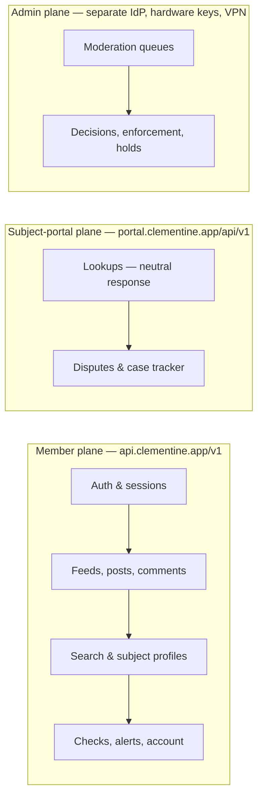

# Clementine — API Design

**Document:** 04-api-design.md · **Status:** Draft v1.0 · **Audience:** Engineering
**Related docs:** [01-product-spec.md](01-product-spec.md) · [02-architecture.md](02-architecture.md) · [03-data-model.md](03-data-model.md) · [05-trust-and-safety.md](05-trust-and-safety.md) · [06-security-and-privacy.md](06-security-and-privacy.md) · [07-ux-flows.md](07-ux-flows.md) · [08-roadmap.md](08-roadmap.md)

This document defines Clementine's HTTP API surfaces: the member API consumed by the React Native app, the public subject-portal API, and the admin/moderation-console API. It is the home of the **per-endpoint authorization annotations** referenced by [06-security-and-privacy.md](06-security-and-privacy.md) §4, and it encodes as API contract the constraints the other documents promise — constrained subject search ([05-trust-and-safety.md](05-trust-and-safety.md) §1.2), non-enumerable IDs and cursors ([06-security-and-privacy.md](06-security-and-privacy.md) T4), verify-then-delete media handling ([06-security-and-privacy.md](06-security-and-privacy.md) §3), and the no-pre-verification-disclosure rule of the Subject Portal ([05-trust-and-safety.md](05-trust-and-safety.md) §4).

## 1. API planes

Three separate surfaces, three separate trust domains. Nothing is shared between them except the backing services.

- **Member plane**: JWT access tokens (15-min) + rotating refresh tokens bound to an attested device; App Attest / Play Integrity verdicts required at signup, login, and sampled per-call ([06-security-and-privacy.md](06-security-and-privacy.md) §4).
- **Subject-portal plane**: no accounts; anonymous, heavily rate-limited intake plus email-and-case-token access to an open case ([07-ux-flows.md](07-ux-flows.md) §3.7).
- **Admin plane**: separate identity provider, WebAuthn hardware keys only, VPN-gated; every read of member data is logged with a reason code ([06-security-and-privacy.md](06-security-and-privacy.md) §4).

## 2. Conventions

- **IDs are UUIDv4, never sequential.** No endpoint accepts or returns an enumerable identifier (threat T4, [06-security-and-privacy.md](06-security-and-privacy.md)).
- **Pagination is opaque-cursor only.** List endpoints take `?cursor=&limit=` (limit ≤ 50). Cursors are HMAC-signed, encode keyset position server-side, expire after 24 h, and are bound to the issuing account — a cursor cannot be replayed by another account or used to walk the corpus. No OFFSET, no page numbers, no stable ordering keys in responses ([03-data-model.md](03-data-model.md) §Indexing).
- **Errors** are RFC 9457 `application/problem+json` with stable `type` slugs; quota exhaustion returns `402 quota_exhausted` with reset time (drives the paywall moments in [07-ux-flows.md](07-ux-flows.md) §3.6).
- **Rate limits** apply per-account and per-IP at the gateway ([02-architecture.md](02-architecture.md)); responses carry `RateLimit-*` headers. Read-velocity anomaly detection feeds T3/T4 scraping controls.
- **Idempotency:** all mutating POSTs accept an `Idempotency-Key` header.
- **Media** is never inline: uploads go through presigned-upload endpoints (EXIF stripped server-side at ingest), and downloads only via short-lived signed URLs (5 min feed images, 60 s sensitive) issued after an object-level authorization check — no permanent object URLs exist ([06-security-and-privacy.md](06-security-and-privacy.md) §2.2).

## 3. Authorization model

All authorization decisions are server-side, centralized in a policy layer, evaluated against the **persona** (member plane) or role (admin plane), default-deny, with object-level checks on every fetch and every media-URL signing request ([06-security-and-privacy.md](06-security-and-privacy.md) §4). Roles used in the annotations below:

| Role | Meaning |
|---|---|
| `public` | No credentials |
| `pending` | Account exists, verification not approved — can only see verification status and the safety hub |
| `member` | Verified, active persona ([03-data-model.md](03-data-model.md)) |
| `plus` | Member with an active Clementine Plus subscription ([01-product-spec.md](01-product-spec.md) §6) |
| `claimant` | Subject-portal case access via email + case token |
| `mod-t1` / `mod-t2` | Tier-1 / Tier-2 moderator ([05-trust-and-safety.md](05-trust-and-safety.md) §6.1); Tier-1 never sees real identity |
| `tns-lead` | T&S lead; unmasking and legal-hold authority (dual-control) |
| `admin` | Infra/owner operations, break-glass only |

Suspended or banned personas resolve to no role: enforcement in [05-trust-and-safety.md](05-trust-and-safety.md) §3 is enforced here, at the policy layer, not per-handler.

## 4. Auth & sessions

| Endpoint | Method | Authz | Notes |
|---|---|---|---|
| `/auth/signup` | POST | `public` | Email (+ optional phone); creates `pending` account; device attestation required |
| `/auth/passkey/register` · `/auth/passkey/assert` | POST | `pending`+ / `public` | Passkeys are the primary credential ([06](06-security-and-privacy.md) §4) |
| `/auth/login` | POST | `public` | Password + TOTP fallback; breached-password screen; attestation required |
| `/auth/refresh` | POST | token | Rotating refresh, device-bound; reuse detection kills the token family |
| `/auth/step-up` | POST | `member`+ | Re-auth for sensitive actions (export, deletion, email change, payment) |
| `/auth/logout` · `/auth/logout-all` | POST | any authenticated | `logout-all` = server-side registry revocation ("log out everywhere") |

## 5. Verification

Media never transits this API. The client talks directly to the IDV vendor via its SDK; Clementine's endpoints handle only session brokering and results ([06-security-and-privacy.md](06-security-and-privacy.md) §3).

| Endpoint | Method | Authz | Notes |
|---|---|---|---|
| `/verification/session` | POST | `pending` | Returns a vendor SDK session token; capture is client→vendor direct |
| `/verification/status` | GET | `pending` | `pending` \| `approved` \| `needs_id` \| `rejected` ([07](07-ux-flows.md) §3.1) |
| `/verification/appeal` | POST | `pending` | Starts the ID-fallback / human-review path |
| `/webhooks/verification` | POST | vendor only | HMAC-signed, IP-allowlisted. Payload contract: verdict, liveness score, gender-consistency signal, over-18 boolean, opaque `vendor_ref`, and the vendor-computed salted one-way `identity_hash` used solely for ban-evasion blocking ([06](06-security-and-privacy.md) §3.4, [05](05-trust-and-safety.md) §3). **The schema rejects media payloads and document numbers** — they cannot arrive here even by vendor misconfiguration. |

## 6. Personas

| Endpoint | Method | Authz | Notes |
|---|---|---|---|
| `/me` | GET | `member` | Persona + quotas + subscription state; never includes identity fields |
| `/me/persona` | POST | `member` (once) | Handle + preset avatar; handle validated against real-name collision ([06](06-security-and-privacy.md) §5) |
| `/me/persona` | PATCH | `member` | Same validations |

## 7. Posts, feeds, comments

| Endpoint | Method | Authz | Notes |
|---|---|---|---|
| `/feeds/city` | GET | `member` | Member's metro only; cursor-paginated; filters: flag type, neighborhood, recency |
| `/feeds/advice` | GET | `member` | Subject-free advice posts (`post_type=advice`, [03](03-data-model.md)) |
| `/posts` | POST | `member` (trust-gated) | Structured body: `post_type` (`subject_report` \| `advice`), subject linkage via §8 candidate confirmation, flags from fixed taxonomy, narrative. Returns screening state (`pending_screening` → `published` \| `held`); posting velocity and severe-claim rights are gated by trust score ([05](05-trust-and-safety.md) §3) |
| `/posts/{id}` | GET | `member` | Removed posts return the redacted stub ([03](03-data-model.md)) |
| `/posts/{id}/comments` | GET/POST | `member` | Same pre-publication screen as posts |
| `/votes` | POST | `member` | "Helped me decide" only; no downvotes |
| `/media/uploads` | POST | `member` | Presigned upload; server-side EXIF strip + OCR/face screen before attach |

## 8. Subject search & profiles

The search contract is deliberately narrow ([05-trust-and-safety.md](05-trust-and-safety.md) §1.2): **first name + photo + coarse location only.** There is no last-name parameter, no free-text query, no location below city granularity — the fields simply do not exist in the schema, so the constraint cannot regress silently.

| Endpoint | Method | Authz | Notes |
|---|---|---|---|
| `/search` | POST | `member` (metered: 5/day free, unlimited `plus`) | Accepts any combination of `first_name`, `photo_upload_id`, `city_id`. Returns subject cards with match confidence; logs to `searches` (30-day retention, [03](03-data-model.md)) |
| `/search/candidates` | POST | `member` | Composer-side "is this the same Ryan?" candidate confirmation ([03](03-data-model.md) §identity resolution) |
| `/subjects/{id}` | GET | `member` | Aggregated posts, flag summary, dispute-outcome annotations |
| `/subjects/{id}/follow` | POST/DELETE | `member` (3 active follows free, unlimited `plus`) | Writes `alert_subscriptions` |
| `/search/saved` | POST | `plus` | Saved-search alert; after the 30-day `searches` window the query survives only as the salted-hash subscription token ([06](06-security-and-privacy.md) §7, [03](03-data-model.md)) |

## 9. Checks: records & reverse-image

| Endpoint | Method | Authz | Notes |
|---|---|---|---|
| `/checks/records` | POST | `member` (metered: 1 basic/month free; bundled allowance for `plus`) | Name + state + age range → registry/criminal/marriage results via the background-check adapter ([02](02-architecture.md)). **Response is transient — results are displayed, never persisted** ([06](06-security-and-privacy.md) §7); only `vendor_ref` is logged. Response contract includes a mandatory non-FCRA framing block the client must render ([05](05-trust-and-safety.md) §5) |
| `/checks/reverse-image` | POST | `member` (metered: 2/month free, 20/month `plus`) | Fans out to external web detection + internal pHash/embedding corpus ([02](02-architecture.md)); query image hashed then discarded within 1 h |

## 10. Alerts

| Endpoint | Method | Authz | Notes |
|---|---|---|---|
| `/alerts` | GET | `member` | Inbox, grouped per subject, digest-capped ([07](07-ux-flows.md) §3.5) |
| `/alerts/subscriptions` | GET | `member` | Follows + saved searches |
| `/alerts/subscriptions/{id}` | PATCH/DELETE | `member` | Mute/unfollow |

Push payloads are data-only — no names, no flag types, no content; the client fetches detail after unlock ([06-security-and-privacy.md](06-security-and-privacy.md) §5).

## 11. Reports & blocks

| Endpoint | Method | Authz | Notes |
|---|---|---|---|
| `/reports` | POST | `member` | `target_type`: post \| comment \| persona \| message; enters the unified queue ([03](03-data-model.md) `reports`) |
| `/blocks` | POST/DELETE | `member` | Enforced in feed, comments, and chat membership |

## 12. Subject Portal API (public web plane)

Anti-enumeration is the design driver ([01-product-spec.md](01-product-spec.md) Non-Goal 5, [05-trust-and-safety.md](05-trust-and-safety.md) §4): the portal must let a genuine subject start a dispute without letting anyone probe whether reports exist about an arbitrary name or photo.

| Endpoint | Method | Authz | Notes |
|---|---|---|---|
| `/portal/lookups` | POST | `public` (heavily rate-limited: per-IP, per-device, per-claimed-identity; CAPTCHA above threshold) | Accepts name + city + photo. **Always returns `202` with a neutral "we will check and respond" body — never a match/no-match signal pre-verification.** The lookup is attached to a case, not answered |
| `/portal/cases` | POST | `public` | Files the dispute (ground + statement); issues the email + case-token tracker |
| `/portal/cases/{id}/verification` | POST | `claimant` | Brokers a vendor IDV session (ID + liveness, client→vendor direct); same delete-after-decision retention as member verification ([06](06-security-and-privacy.md) §3) |
| `/portal/cases/{id}` | GET | `claimant` | **Only after verification succeeds** does the case disclose whether matching content exists; then status, SLA clocks, decision, rationale |
| `/portal/cases/{id}/appeal` | POST | `claimant` | ≤30 days; senior-reviewer lane ([05](05-trust-and-safety.md) §4) |

## 13. Account, privacy, and data-subject requests

| Endpoint | Method | Authz | Notes |
|---|---|---|---|
| `/me/export` | POST | `member` + step-up | Async export; DM metadata at coarse timestamps ([06](06-security-and-privacy.md) §6) |
| `/me` | DELETE | `member` + step-up | 30-day grace, then the deletion cascade in [03](03-data-model.md); author's content choice (`keep as former member` \| `delete my content too`) is a parameter |
| `/dsr` | POST | `public` | Non-user data-subject requests (GDPR/CCPA); routes into the same case system as portal disputes |

## 14. Admin & moderation console (admin plane)

The surface behind [05-trust-and-safety.md](05-trust-and-safety.md) §6.2. Separate IdP, hardware-key WebAuthn, VPN; least-privilege roles; every read logged with a reason code and sampled for review ([06-security-and-privacy.md](06-security-and-privacy.md) §4).

| Endpoint | Method | Authz | Notes |
|---|---|---|---|
| `/admin/queues/{priority\|standard\|sampling}` | GET | `mod-t1`+ | Unified queue with model scores, account history, subject-cluster view; persona-level only for Tier-1 |
| `/admin/cases/{id}` | GET | `mod-t1`+ | Content + context; severe-claim and dispute cases require `mod-t2`+ to decide |
| `/admin/cases/{id}/decision` | POST | `mod-t1` (routine) / `mod-t2`+ (severe claims, disputes, appeals) | Mandatory policy citation + rationale capture; writes `moderation_actions` + audit log |
| `/admin/enforcement` | POST | `mod-t2`+ | Ladder actions (warn, suspend, ban) per [05](05-trust-and-safety.md) §3; bans register ban-evasion signals |
| `/admin/subjects/{id}/merge` · `/split` | POST | `mod-t2`+ | Highest-severity data operation ([03](03-data-model.md)); audited, reversible via linked actions |
| `/admin/personas/{id}/unmask` | POST | `tns-lead`, **dual-control** | Identity↔persona bridge read (asset A2); peer approval + audit, legal-process cases only |
| `/admin/legal-holds` | POST/DELETE | `tns-lead` | Freezes purge jobs for named entities ([03](03-data-model.md) `legal_holds`) |
| `/admin/verification/review/{id}` | GET/POST | `mod-t2`+ (verification reviewers) | Quarantined media via the watermarking no-download viewer; decisions trigger the purge pipeline ([06](06-security-and-privacy.md) §3.3) |
| `/admin/metrics` | GET | `mod-t1`+ | Signals dashboard: queue depth vs. SLA, PII-block rates, per-subject velocity |

## 15. Messaging API (v2, contract sketch)

DMs ship in the last roadmap phase, E2E-encrypted from day one ([06-security-and-privacy.md](06-security-and-privacy.md) §6, [08-roadmap.md](08-roadmap.md)). The server API is deliberately dumb: key-bundle registration and ciphertext relay.

| Endpoint | Method | Authz | Notes |
|---|---|---|---|
| `/keys/bundle` | PUT/GET | `member` | libsignal prekey bundles |
| `/chats` · `/chats/{id}/messages` | POST/GET | `member` (chat member) | Ciphertext + franking tag only; server cannot decrypt ([03](03-data-model.md) `messages`); 90-day default retention |
| `/chats/{id}/report` | POST | `member` (chat member) | Franking-verified disclosure of the reported thread to T&S — the only server-visible plaintext path, reporter-initiated |

---

*Contracts here bind the promises made elsewhere: if a field is absent from this document (a last-name search parameter, a media field on the verification webhook, a plaintext message body), adding it is a cross-document design change, not a patch.*
