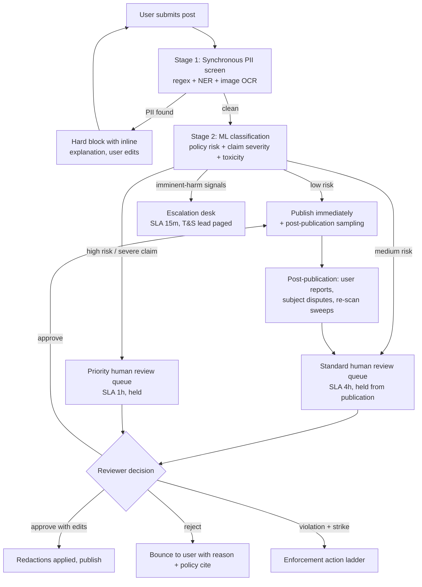
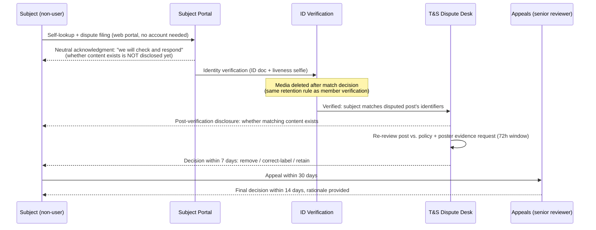

# Clementine — Trust & Safety

> **Document 05 of 8.** Product requirements live in [01-product-spec.md](01-product-spec.md); the systems that enforce this policy are specified in [02-architecture.md](02-architecture.md) and [04-api-design.md](04-api-design.md); moderation and dispute data structures in [03-data-model.md](03-data-model.md); security controls and privacy engineering in [06-security-and-privacy.md](06-security-and-privacy.md); user-facing reporting and appeal screens in [07-ux-flows.md](07-ux-flows.md); staffing and rollout sequencing in [08-roadmap.md](08-roadmap.md).

Clementine's core loop — verified women anonymously sharing information about named, identifiable men — is simultaneously the product's value and its largest liability. A post that helps one woman avoid a predator can, if the system fails, defame an innocent man, dox a family, or hand an abuser a weapon. Trust & Safety is therefore not a support function here; it is the product. This document defines what we allow, how content is screened before and after publication, what rights the men who are subjects of posts have, our legal posture, and how the team operates day to day.

**Design principles**

1. **Prevention over cleanup.** The worst harms (doxxing, false accusation going viral) are cheap to prevent pre-publication and nearly impossible to undo after. Every post passes automated screening *before* anyone sees it.
2. **Subjects have rights even though they are not users.** A man discussed on Clementine never agreed to our terms. He still gets notice-equivalent channels, a dispute process, and statutory privacy rights (GDPR/CCPA apply to his data regardless of whether he has an account).
3. **Safety claims are privileged; everything else is not.** The bar for hosting "he has a restraining order against him" (safety-relevant, verifiable) is different from "he's short and boring" (gossip). Policy, ranking, and moderation all encode this distinction.
4. **Assume every screen is screenshotted.** Tea's content leaked constantly via screenshot to Reddit and TikTok; its DM database eventually leaked wholesale. We design content and data handling assuming exfiltration, and we minimize what exists to exfiltrate (see [06-security-and-privacy.md](06-security-and-privacy.md)).

---

## 1. Abuse-vector inventory

Each vector lists the threat, why Clementine is specifically exposed, and layered mitigations. Residual risk is owned by the T&S lead and reviewed quarterly.

### 1.1 False accusations

**Threat.** A user fabricates or exaggerates misconduct about a real man — out of spite, mistake, or misidentification (wrong "Mike, 34, Chicago"). This is the defamation engine of the product category.

**Mitigations.**
- Structured posting flow forces **firsthand-experience attestation** ("I personally dated/matched with this person") with a legal-perjury-adjacent warning; secondhand claims must be labeled as such and are down-ranked and excluded from search snippets.
- Claim-type taxonomy: severe allegations (assault, violence, criminal conduct) route to **mandatory human review before publication**, regardless of ML score.
- **Misidentification guards**: posts require at least two identifying signals (first name + photo, or first name + dating-app screenshot with faces of third parties blurred); free-text last names are blocked by the PII screen (§2) to keep subjects searchable-in-context but not Google-indexable.
- Poster accountability without deanonymization: every post is tied to a verified real identity internally ([03-data-model.md](03-data-model.md)), so repeat fabricators are bannable across accounts and identifiable pursuant to valid legal process.
- Subject dispute flow (§4) can result in labeling, correction, or removal.
- Rate limits: a single account posting about many different men in a short window is flagged for review.

### 1.2 Doxxing

**Threat.** Posts or comments include a subject's home address, workplace, phone number, plate number, or social handles — enabling real-world harassment of him or his family.

**Mitigations.**
- **Hard pre-publication blocks** on addresses, phone numbers, email addresses, employer names, and social handles via the PII screening stage (§2.1). This is a block, not a flag: the post cannot be submitted until the content is removed. Same screen runs on comments and DMs at send time.
- OCR runs on all uploaded images to catch PII embedded in screenshots (dating-profile screenshots often show workplace and school fields — these are auto-blurred).
- "Where does he work?" style solicitation in comments is a policy violation (§3) and auto-flagged.
- Search is deliberately constrained ([04-api-design.md](04-api-design.md)): first name + photo + coarse location only. No last-name index, no reverse lookup from a photo to a full identity dossier.

### 1.3 Extortion and leverage

**Threat.** (a) A user threatens a man: "pay me / take me back or I post about you here." (b) An outsider scrapes posts and blackmails subjects. (c) A user threatens another user with exposure of her identity or posts.

**Mitigations.**
- Off-platform threats referencing Clementine are actionable when reported; a dedicated intake exists for subjects (§4) and threats-to-post are treated as severity-1 violations with permanent bans.
- Anti-scraping: authenticated-only content, no public web surface for posts, per-account read-rate anomaly detection, screenshot deterrence (§1.5).
- Extortion attempts against users escalate to the LE-liaison runbook (§6.3) — sextortion patterns are NCMEC/FBI-referrable where applicable.

### 1.4 Men infiltrating the women-only space

**Threat.** Men create accounts to surveil posts about themselves, harvest content, harass posters, or discredit the community — using borrowed accounts, fake IDs, or AI-generated verification selfies.

**Mitigations.**
- Layered verification ([01-product-spec.md](01-product-spec.md), [06-security-and-privacy.md](06-security-and-privacy.md)): liveness-checked selfie with challenge gestures (defeats static AI images and replays), vendor-assisted gender estimation as a signal (never sole arbiter), ID verification for appeals and edge cases, device/SIM integrity signals. Human review of low-confidence cases.
- **Verification media is deleted after decision** (Tea's breach lesson — retention was the harm multiplier), so a successful infiltrator gains account access but no trove exists to steal.
- Post-verification behavioral detection: accounts that only search/read one subject, never post, and match the subject's inferred identity signals get re-verification challenges.
- Account transfer/sale is a ban; periodic liveness re-checks on anomalous accounts.
- Honest framing: verification raises cost, it doesn't make infiltration impossible — which is why doxxing prevention (§1.2) protects users even if the wall is breached, and why user identities are never displayed, only personas.

### 1.5 Screenshot exfiltration

**Threat.** Members screenshot posts and repost them publicly (Reddit, group chats, the subject himself), destroying context, amplifying defamation exposure, and exposing posters to retaliation if content is traceable to them.

**Mitigations.**
- FLAG_SECURE / screenshot suppression on Android; screenshot-detection notice on iOS with a policy warning ("sharing content outside Clementine violates community guidelines and may expose you to legal risk").
- **Forensic-lite deterrence**: per-session subtle rendering variations (persona display ordering, whitespace fingerprinting) let us trace leaked screenshots to an account in egregious cases; this is disclosed in the ToS.
- No poster-identifying metadata visible on any screen; personas rotate per-post display salt so screenshots don't link a persona across posts.
- Cultural enforcement: leaking is a first-strike permanent ban, and we say so loudly in onboarding ([07-ux-flows.md](07-ux-flows.md)).

### 1.6 Brigading and coordinated posting

**Threat.** A group coordinates to pile onto one man (or to mass-report a truthful post into removal). Includes organized off-platform campaigns entering the app.

**Mitigations.**
- Velocity detection on per-subject post/comment rates; sudden multi-account attention to one subject freezes new posts on that subject pending review.
- Mass-report review: reports from accounts with correlated signup times/devices are weighted down; report-abuse is itself a violation.
- Comment sections on severe-allegation posts are review-gated during spikes.

### 1.7 Revenge posting by proxies (exes' friends, family)

**Threat.** The firsthand rule is laundered: a poster's friend posts "my friend dated him and he cheated," or a man's new partner is attacked via posts about him designed to reach her.

**Mitigations.**
- Secondhand content must be labeled and carries no red-flag badge weight; unlabeled secondhand content detected by classifiers ("my friend," "my sister") is bounced back for labeling or blocked for severe claims.
- Motive-pattern detection: accounts created shortly before their first and only post about one subject, with mutual-connection signals, get elevated review.
- The dispute process (§4) explicitly accepts "the poster never dated me" as a contest ground, triggering evidence re-review.

---

## 2. Moderation pipeline

All content — posts, comments, images, DMs (metadata-level only for DMs; see privacy boundaries in [06-security-and-privacy.md](06-security-and-privacy.md)) — flows through the same pipeline skeleton. Posts about named subjects get the strictest path.

### 2.1 Stage 1 — Synchronous PII screening (pre-publication, blocking)

Runs in-line at submission (<300 ms budget; [02-architecture.md](02-architecture.md)):

- **Pattern detection**: phone numbers (all common formats/obfuscations like "555 dot 0123"), emails, street addresses (libpostal-style parsing), plates, government ID patterns, URLs to social profiles.
- **NER**: employer/organization names in "works at" context, school names, full-name detection (last names blocked in subject references).
- **Image pipeline**: OCR on every upload; face detection with mandatory blur tool for third-party faces in screenshots; EXIF/GPS stripping (also enforced server-side).
- **Behavior**: hard block with a specific, educational inline message ("We removed what looks like a workplace — Clementine doesn't allow information that lets someone be located"). Blocks are logged; three PII-block evasion attempts (creative respellings) flag the account.

The same screen runs on comments and — client-side before encryption — on DM composition, where it warns rather than hard-blocks except for addresses/phones of third parties.

### 2.2 Stage 2 — ML classification

An ensemble scores every clean submission on: policy-violation likelihood (threats, harassment, appearance-shaming, minor-related content, non-dating context), **claim severity** (none → misconduct → criminal allegation), secondhand-language detection, and coordination signals (account age, subject-attention velocity). Scores route content to one of four outcomes shown in the diagram. Severity thresholds are deliberately conservative at launch: **all criminal-conduct allegations are human-reviewed pre-publication**, whatever the model says.

### 2.3 Stage 3 — Human review queues

| Queue | Contents | SLA | Staffing (launch) |
|---|---|---|---|
| Priority | Severe allegations, imminent-harm flags, subject disputes | 1 h (15 m for escalation desk) | On-call rotation, 24/7 via outsourced Tier-1 + internal Tier-2 |
| Standard | Medium-risk posts, appeals, mass-report clusters | 4 h | Business-hours internal + vendor overflow |
| Sampling/QA | 5% random sample of auto-published content; reviewer-decision audits | 48 h | T&S lead + senior reviewer |

Reviewers work from a policy-cited decision tool (§6.2) with per-decision rationale capture — this record is what makes appeals and legal defense tractable. Reviewer wellness protocol (content rotation, counseling access) is mandatory given exposure to abuse narratives.

### 2.4 Post-publication

User reports (in-product), subject disputes (§4), periodic re-scans when policy or models change, and burst-mode controls: during viral growth spikes (Tea's July-2025 trajectory is the design case), auto-publish thresholds tighten and non-critical queues shed load to protect priority SLAs.

---

## 3. Content policy (outline)

The full policy ships as in-product guidelines; this is the normative skeleton.

**Allowed**
- Firsthand accounts of dating, matching, or relationship experiences with an adult man, including red-flag/green-flag assessments.
- Safety warnings grounded in firsthand experience or public records surfaced through Clementine's own lookup features (registry hits, court records — auto-cited to source).
- Questions and advice-seeking ("has anyone matched with this profile?"), catfish checks, pattern warnings about scam profiles.
- Labeled secondhand warnings, down-weighted and excluded from severe-badge treatment.

**Banned**
- Threats, incitement, or organizing harassment (on- or off-platform), including solicitation of a subject's location or workplace.
- Doxxing: any address, phone, email, employer, school, plate, or social handle of any non-consenting person (enforced by §2.1 regardless of intent).
- Appearance-, disability-, or identity-based shaming with no safety relevance; revenge porn / intimate imagery (blocked by image pipeline + hash-matching).
- Any content about **minors** as subjects, and any sexual content involving minors (NCMEC-reportable, zero tolerance).
- Non-dating contexts: coworkers, bosses, landlords, family disputes, custody battles — Clementine is not a general grievance board; this boundary is a core defamation-exposure control.
- Fabricated content, impersonation, posting on behalf of another as if firsthand, extortion or threat-to-post, commercial spam, and content-exfiltration (leaking screenshots).

**Enforcement ladder**: educational bounce → warning strike → posting suspension → permanent ban (identity-linked, so re-signup is blocked at verification). Severity-1 violations (threats, doxxing with intent, CSAM, extortion, leaking) skip straight to permanent ban and, where applicable, LE referral.

**Ban evasion.** Permanent bans are identity-linked, not account-linked. At ban time we retain three signals, each useless for anything except re-entry blocking: an HMAC of the account's email/phone ([03-data-model.md](03-data-model.md) retention table), the vendor-computed salted one-way `identity_hash` captured at verification ([06-security-and-privacy.md](06-security-and-privacy.md) §3.4 — the vendor derives it from the ID document; Clementine never holds the raw document number), and the opaque `vendor_ref` for vendor-side re-check. A new signup matching any of these signals is refused at verification or routed to Tier-2 review; matches and refusals are recorded as `moderation_actions`. Device/SIM integrity signals (§1.4) add friction but are never the sole basis for refusal.

**Trust score and privilege gating.** `personas.trust_score` ([03-data-model.md](03-data-model.md)) is an internal, never-displayed integer that gates privileges. It is earned through account tenure, posts and comments that pass screening cleanly, "helped me decide" signals, and accurate content reports; it is lost through strikes, PII-block evasion attempts, bounced or removed posts, disputes upheld against the poster (§4), and mass-report abuse (§1.6). What it gates (thresholds owned by the T&S lead, reviewed monthly with the §6.4 metrics): posting and commenting velocity caps tighten at low scores; severe-claim posts from low-score accounts get mandatory human review regardless of classifier score, and are blocked below a floor; commenting on severe-allegation posts during brigade freezes (§1.6) is limited to established-score accounts; and moderator-pipeline (Priya-track) eligibility requires a sustained high score. Every score-driven gate change is recorded as a `moderation_action`, so gating is auditable and appealable — the score influences friction, never publication outcomes by itself.

---

## 4. Subject rights: notice, takedown, dispute, appeal

Men discussed on Clementine are data subjects and potential defamation plaintiffs, not an enemy class. A credible, fast dispute channel is both ethically required and our best litigation-avoidance tool.

- **Discovery / notice.** We do not proactively notify subjects (that would itself create harm and stalker-tooling risk), but we operate a public, indexable **Subject Portal** landing page — linked from our site, ToS, and all correspondence — where anyone can submit "is there content about me?" and file a dispute. This is the notice-equivalent for non-users. Crucially, the portal *accepts* the lookup without *answering* it: whether matching content exists is disclosed only **after** the ID + liveness verification step succeeds. Pre-verification, the requester sees only a neutral "we will check and respond" state — so the portal cannot be used by an abuser, a scraper, or a curious third party to probe whether reports exist about any name or photo, preserving [01-product-spec.md](01-product-spec.md) Non-Goal 5 (no unauthenticated search). Portal lookups are rate-limited per IP, device, and claimed identity, with CAPTCHA above threshold ([04-api-design.md](04-api-design.md) §12).
- **Identity verification** prevents the obvious attack: a random man (or an abuser) using the portal to unmask posters or scrub warnings about someone else — and, per the above, it also gates *disclosure*: no match/no-match signal is ever released to an unverified requester. Verification confirms the requester matches the post's identifying signals (name, photo similarity, location). Verification media follows the same delete-after-decision rule as member verification.
- **Dispute grounds**: factual falsity, misidentification ("that's not me" / "she never dated me"), policy violation missed in review, or a statutory privacy request (§5.3).
- **Outcomes**: removal; correction (e.g., "disputed" label with the subject's statement appended); redaction of specific claims; or retention with written rationale. The poster is asked for supporting evidence within 72 hours; non-response weighs toward removal for severe claims.
- **Timelines** (tracked as SLAs in tooling): acknowledgment 24 h; decision 7 days (48 h expedited when the dispute alleges imminent-harm content or doxxing residue); appeal decision 14 days. Statutory deletion requests follow the shorter of these or the legal deadline.
- All dispute artifacts are stored in the moderation case system ([03-data-model.md](03-data-model.md)) with litigation-hold capability.

---

## 5. Legal posture

*(Framework for counsel review — not legal advice; retain platform-liability counsel before beta, per [08-roadmap.md](08-roadmap.md).)*

### 5.1 Section 230 and its limits

47 U.S.C. §230 protects Clementine from being treated as the publisher of users' posts, and §230(c)(2) protects our good-faith moderation. We rely on it — but we do not build the business on it, because:

- §230 does not cover **federal criminal liability**, intellectual-property claims, or FOSTA-carved conduct.
- It does not protect content we **materially contribute to** — so product mechanics must not compose or embellish allegations (e.g., we auto-cite public-records results to their source rather than paraphrasing them into our own assertions; badges aggregate user labels rather than stating platform conclusions).
- It does not stop suits from being *filed*: defamation suits against Tea-like platforms and their users are a foreseeable, recurring cost. Operational minimization (pre-publication review of severe claims, the dispute process, fast correction) shrinks both the volume and the optics of these cases.
- Poster anonymity is not absolute: we comply with valid subpoenas for poster identity (disclosed in ToS and onboarding), while committing to notify the affected user where legally permitted and to resist facially defective or abusive demands.

### 5.2 Operational defamation minimization

Truth is the defense, and firsthand accounts are the content most likely to be true and least likely to be actionable as reckless. Hence: firsthand attestation, secondhand labeling, severe-claim human review, structured claim types instead of free-form accusation prompts, the correction/labeling remedy (retraction behavior matters in damages), and complete moderation audit trails.

### 5.3 GDPR / CCPA — including non-user subjects

Posts about an identifiable man are his **personal data**. Both regimes apply regardless of whether he has an account.

- **Lawful basis (GDPR)**: legitimate interests (Art. 6(1)(f)) — users' and the community's safety interest — documented in a Legitimate Interests Assessment balancing against subjects' rights. Criminal-allegation content (Art. 10-adjacent) gets heightened handling.
- **Subject rights**: access (what content references me), rectification (the correction flow), erasure — honored via the Subject Portal with the identity-verification step doubling as the anti-fraud check GDPR expects. Erasure requests for safety-critical, truthful content invoke the Art. 17(3) freedom-of-expression balancing test, decided case-by-case with counsel-approved criteria; we do not promise automatic deletion of warnings about verified dangerous conduct, and we document every balancing decision.
- **CCPA/CPRA**: deletion and access rights for California subjects, "sensitive personal information" handling for verification data, and no sale/sharing of personal data — full-stop, as a product commitment ([06-security-and-privacy.md](06-security-and-privacy.md)).
- **Users' own rights** (export, deletion) and retention schedules are specified in [06-security-and-privacy.md](06-security-and-privacy.md).

### 5.4 Age gating

18+ only, enforced at verification (ID date-of-birth where collected; age-estimation signal on selfies with ID fallback for borderline results). Content about minors as dating subjects is banned and reviewed as a potential-CSAM/endangerment escalation. COPPA is out of scope by design, but under-18 detection triggers immediate account termination and data deletion.

---

## 6. T&S operations

### 6.1 Team (within a 4–6 person startup)

- **T&S lead (founding hire, in-house)**: owns policy, escalations, LE liaison, vendor management. This is a day-one role, not a post-launch add.
- **Tier-1 review**: outsourced to a vetted vendor with our decision tooling, 24/7 coverage; sized to queue volume with burst contracts for viral spikes.
- **Tier-2 / appeals**: T&S lead + one trained internal generalist; severe-claim and dispute decisions never sit with Tier-1 alone.
- **Counsel**: external platform-liability and privacy counsel on retainer; escalation path defined below.
- Every internal employee does a quarterly review-queue rotation — policy empathy is a team-wide competency.

### 6.2 Tooling

- **Moderation console** ([04-api-design.md](04-api-design.md) admin surface): unified queue with content, model scores, account history, subject-cluster view (all content about one subject), policy-cited decision buttons, and mandatory rationale capture.
- **Case management** for disputes, LE requests, and litigation holds — with SLA timers and audit logs.
- **Signals dashboard**: queue depths vs. SLA, PII-block rates, classifier precision/recall from QA sampling, per-subject velocity alerts, reviewer agreement rates.
- Access to moderation tooling is least-privilege, session-logged, and never exposes poster real identity to Tier-1 reviewers (persona-level only; identity unmasking is a Tier-2, dual-control operation).

### 6.3 Escalation runbook

| Trigger | Action | Owner | Clock |
|---|---|---|---|
| Imminent physical harm (threats, suicide/self-harm, stalking-in-progress signals) | Escalation desk review; emergency LE disclosure if threshold met (imminent danger exception); user directed to resources | T&S lead (paged) | 15 min |
| CSAM / minor endangerment | Preserve, hash, report to NCMEC; terminate account; no internal re-viewing beyond necessity | T&S lead | Same day |
| Extortion / sextortion | Preserve evidence, LE referral path offered to victim, ban | T&S lead | 24 h |
| Press/viral incident (leaked screenshot storm, viral false-accusation claim) | Comms + T&S joint response; content re-review; counsel notified | CEO + T&S lead | Same day |
| Data-incident suspicion | Invoke security IR plan in [06-security-and-privacy.md](06-security-and-privacy.md) | Security owner | Immediate |

**Law-enforcement requests.** All requests route to a dedicated intake (legal@ + portal). Process: authenticate the requester → validate legal sufficiency (subpoena/court order/warrant matched to data category: content requires more process than basic subscriber info) → scope-minimize → counsel review for anything touching poster identity → produce with logging → notify the affected user unless legally barred or in emergency-disclosure cases. Preservation requests honored per §2703(f)-style obligations. We publish an annual transparency report (request counts, compliance rates) — small startups skip this; we won't, because our users' anonymity promise depends on demonstrated discipline.

### 6.4 Metrics that govern

Policy health is reviewed monthly against: pre-publication block precision (false-block rate <5%), severe-claim review SLA adherence (>99%), dispute decision timeliness, post-publication violation discovery rate (proxy for screening misses), subject-dispute overturn rate (high = screening too lax; near-zero = dispute desk may be rubber-stamping retention), and reviewer QA agreement. These metrics gate growth: if SLAs break during a viral spike, posting throttles tighten automatically before quality does.
