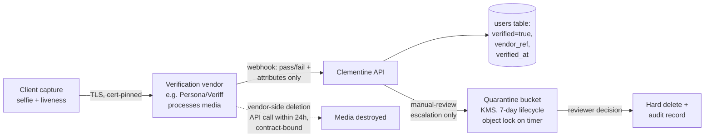

# Clementine — Security & Privacy Engineering

> Document 06 of 8. Companion to [02-architecture.md](02-architecture.md) (infrastructure this doc constrains), [03-data-model.md](03-data-model.md) (retention fields referenced here), [05-trust-and-safety.md](05-trust-and-safety.md) (moderation processes that depend on the DM-encryption decision), and [08-roadmap.md](08-roadmap.md) (when each control ships).

Clementine's product is trust. Members hand us the two most sensitive things they own — proof of their identity and candid accounts of men who may have harmed them — on the promise of anonymity. Tea made the same promise and broke it in July 2025, leaking the verification selfies and IDs of the very women it existed to protect. This document treats that breach as our design brief: every control below is either a direct countermeasure to a known failure mode or a structural guarantee that a class of failure cannot occur.

**Governing principles**

1. **Data we don't hold can't leak.** Minimize, delete, and tokenize before we encrypt.
2. **Private by default, at the platform layer.** Safety properties are enforced by infrastructure policy, not developer diligence.
3. **Assume breach.** Every store is designed around the question "what does the attacker get when this is exfiltrated?"
4. **Anonymity is a security property**, not a UX feature. De-anonymizing a member is a critical-severity incident, equal to credential theft.

---

## 1. Threat Model

Scope: mobile clients, API, object storage, verification pipeline, DM system, third-party integrations (verification vendor, public-records providers, push). Assets ranked: (A1) verification selfies/IDs, (A2) member real identity ↔ persona mapping, (A3) DM content, (A4) post/report content and subject data, (A5) search history, (A6) credentials and tokens.

| # | Attacker | Asset | Vector | Primary controls |
|---|----------|-------|--------|------------------|
| T1 | Opportunistic scanner (the Tea attacker profile) | A1 verification media | Misconfigured public bucket, guessable object URLs | No public buckets (org-level policy), deletion after review, KMS encryption, short-lived signed URLs (§2, §3) |
| T2 | Aggrieved subject of a post | A2 persona mapping | Legal threats, social engineering of staff, correlating post metadata | Identity/persona separation in the data model, EXIF stripping, staff access controls, legal-request runbook (§5, §8) |
| T3 | Stalker / abusive ex who is a subject | A2, A4 | Creating fake female accounts to read posts about himself; scraping local feeds | Liveness-checked verification, per-city rate limits, scraping detection, screenshot deterrence (§4, §5) |
| T4 | Mass scraper / data broker | A4, A5 | Enumeration of feed and search APIs | Authenticated-only API, cursor pagination without stable IDs, per-account velocity limits, bot/device attestation (§4) |
| T5 | Credential-stuffing attacker | A6 → all | Reused passwords from other breaches | Mandatory MFA paths, breached-password checks, device binding, session revocation (§4) |
| T6 | Malicious or negligent insider | A1–A5 | Over-broad admin tooling, prod DB access | Least-privilege admin roles, audited break-glass access, no direct prod DB access, verification media invisible to general staff (§3, §8) |
| T7 | Nation-state / sophisticated actor | A3 DMs | Full database exfiltration | E2E encryption of DM content — ciphertext-only breach yield (§6) |
| T8 | Subpoena / compelled disclosure | A2, A5 | Legal process | Data minimization (can't produce what we don't retain), transparency policy, counsel review (§7, §9) |
| T9 | Supply-chain attacker | A6, infra | Compromised dependency, leaked CI secrets | Lockfile pinning, SCA scanning, OIDC-federated CI (no long-lived cloud keys), secrets manager (§7) |
| T10 | Member turned bad actor | A4 (as a weapon) | Doxxing content in posts, coordinated defamation | Pre-publication screening pipeline — owned by [05-trust-and-safety.md](05-trust-and-safety.md); this doc supplies the enforcement infrastructure |

---

## 2. The Tea Breach, and Why It Cannot Recur Here

**What happened (July 2025).** Tea stored verification media in a Firebase storage bucket that was publicly readable. Roughly 72,000 images were exfiltrated, including ~13,000 verification selfies and government IDs — data Tea had said was deleted after review. Images were mapped and circulated on 4chan. A second, worse discovery followed: ~1.1 million DMs were accessible, containing discussions of abuse, infidelity, and identifiable third parties. Three compounding failures: (1) a public bucket, (2) a broken retention promise, (3) plaintext DMs whose entire value to an attacker survived exfiltration.

Each failure maps to a Clementine control that is **structural** — enforced by the platform, not by remembering to configure things correctly:

### 2.1 No public buckets — as policy, not configuration

- Org-level policy (AWS SCP denying `s3:PutBucketPolicy`/`PutBucketAcl` that grants public access, plus account-wide S3 Block Public Access; GCP equivalent: org policy `constraints/storage.publicAccessPrevention` enforced) makes a public bucket **impossible to create**, even by an admin, even by mistake. This is the single most important lesson from Tea: the fix is not "configure the bucket correctly," it is "make the incorrect configuration unrepresentable."
- All object storage is provisioned via Terraform modules that bake in: private ACL, default KMS encryption, TLS-only bucket policy, access logging, versioning. Hand-created buckets are flagged and quarantined by a nightly drift-detection job.
- Continuous verification: an automated external scanner attempts anonymous reads against every bucket and public-URL pattern daily; any success pages on-call as a SEV-1.

### 2.2 Media access only via short-lived signed URLs

- No object is ever addressed by a permanent public URL. Clients receive signed URLs (5-minute TTL for feed images, 60 seconds for anything sensitive), scoped to a single object, issued by the API only after an authorization check against the requesting persona.
- Object keys are random UUIDs — no user IDs, dates, or sequential IDs in key names, so a leaked key discloses nothing and enumeration is infeasible.

### 2.3 Retention promises enforced by machinery

Tea's deepest betrayal was the gap between its stated policy ("deleted after review") and reality. Clementine closes that gap with the pipeline in §3: deletion is executed by lifecycle rules and verified by audit, not performed manually and assumed.

### 2.4 DMs designed for breach

Tea's DM leak was catastrophic because plaintext at rest meant exfiltration = full disclosure. Clementine's DM design (§6) assumes the message store *will* someday be exfiltrated and engineers for a ciphertext-only yield.

---

## 3. Verification Data Pipeline

Verification (women-only gate; see [01-product-spec.md](01-product-spec.md) §signup and [07-ux-flows.md](07-ux-flows.md) for the user-facing flow) is the highest-risk data flow in the system. Design goal: **verification media exists in our custody for minutes-to-hours, never indefinitely, and its deletion is provable.**

Key properties:

1. **Media never transits Clementine's servers in the happy path.** The client uploads directly to a specialist IDV vendor via their SDK (vendor selection criteria in [02-architecture.md](02-architecture.md)). We receive a signed webhook containing only: pass/fail, liveness score, inferred gender-consistency signal, an opaque `vendor_ref`, and a vendor-computed salted one-way identity hash (for ban-evasion blocking; see item 4). We never receive or store the ID document number, date of birth (beyond an over-18 boolean), or the image itself in this path.
2. **Vendor retention is contract-bound and API-enforced.** After a decision is recorded, an async job calls the vendor's deletion API within 24 hours and stores the deletion receipt. A weekly reconciliation job queries the vendor for any retained records tied to our account and alarms on nonzero results.
3. **The manual-review exception is time-boxed.** Ambiguous cases (~expected 3–8%) route media to a dedicated quarantine bucket: separate AWS account, KMS CMK with key policy restricted to the review service role, bucket lifecycle rule hard-deleting at 7 days regardless of review outcome, S3 Object Lock preventing TTL extension without a break-glass process. Reviewers see media through a viewer that watermarks the reviewer identity and never allows download.
4. **What survives is minimal — and expires**: `verified: true`, timestamp, vendor reference, and a vendor-computed salted one-way identity hash (`identity_hash`, [03-data-model.md](03-data-model.md)) *only* to prevent one banned identity from re-verifying (ban-evasion ladder in [05-trust-and-safety.md](05-trust-and-safety.md) §3). The vendor derives the hash from the ID document and returns only the hash — consistent with item 1, Clementine never receives the document number itself. Outcome metadata is retained for 1 year per the retention schedule in [03-data-model.md](03-data-model.md), not indefinitely; the hash is stored separately from the persona.
5. **Deletion is audited.** Every deletion (ours and the vendor receipt) writes to an append-only audit log. Quarterly, we sample audit records against storage inventory to prove the pipeline works — this evidence feeds SOC 2 (§9) and lets us make Tea's promise *truthfully*: "your selfie is deleted after review, and we can prove it."

## 4. Authentication & Authorization Hardening

- **Accounts:** passkeys as the primary credential (phishing-resistant, no password database to crack); password + TOTP as fallback with breached-password screening (k-anonymity check against HIBP-style corpus) and Argon2id hashing. SMS OTP only as a recovery factor of last resort, never sole-factor.
- **MFA:** required for any sensitive action (email change, data export, account deletion, payment) via step-up re-auth; required always for admin/moderator accounts (hardware-key WebAuthn only — no TOTP for staff).
- **Device attestation:** App Attest (iOS) / Play Integrity (Android) verdicts required at signup, login, and on a random sample of API calls. This is a primary anti-scraping and anti-fake-account control (T3, T4): emulators and modified clients fail attestation and are routed to high-friction verification.
- **Sessions:** short-lived access tokens (15 min) + rotating refresh tokens bound to the attested device. Server-side session registry supports instant revocation — per-session, per-device, or account-wide — triggered by password change, verification revocation, ban, or user request ("log out everywhere" in settings, [07-ux-flows.md](07-ux-flows.md)). Refresh-token reuse detection kills the whole token family.
- **Authorization:** all API authorization decisions taken server-side against the *persona*, centralized in a policy layer (see [04-api-design.md](04-api-design.md) for per-endpoint authz annotations). Default-deny; object-level checks on every media URL signing request (no IDOR-by-omission).
- **Admin plane:** separate identity provider, VPN + hardware key, per-role least privilege (moderator ≠ T&S lead ≠ infra), every admin read of member data logged with reason codes and sampled for review. No standing production database access for anyone; break-glass grants are time-boxed, peer-approved, and alarmed.

## 5. Anonymity Protections for Members

The persona system ([03-data-model.md](03-data-model.md)) separates `identity` (legal-ish: email, verification status, payment) from `persona` (display name, avatar, activity). Controls that keep the wall intact:

- **No real names surfaced, ever.** Persona display names are validated against the identity record — a member cannot accidentally set her real name as her handle without an interstitial warning; her real name never appears in any API response, push payload, or email visible to other members.
- **EXIF and metadata stripping** on every uploaded image, server-side at ingest (GPS, device serial, capture time removed; images re-encoded to strip steganographic thumbnails). Uploaded photos of subjects are additionally perceptual-hashed for the reverse-image feature *after* stripping.
- **Metadata hygiene:** post timestamps displayed at coarse granularity ("this week"); city-level location only, never precise geo; internal IDs are non-sequential UUIDs.
- **Screenshot deterrence — and honesty about its limits.** Android: `FLAG_SECURE` on DM and feed screens (blocks native screenshots). iOS: no true blocking exists; we detect `userDidTakeScreenshot`, log it, notify the counterparty in DMs, and rate-limit accounts with heavy screenshot behavior. We are explicit in product copy and in [01-product-spec.md](01-product-spec.md): **screenshot deterrence is friction, not a guarantee** — a second phone camera defeats everything. The real protections are the verification gate on who gets in and velocity limits on how much any account can see (T3/T4). We do not market deterrence as security.
- **Push notifications** contain no content by default (mutable/data-only pushes; content fetched after unlock) so lock-screen previews and push-provider logs never carry post or DM text.

## 6. DM Encryption: E2E vs. Moderation — Analysis and Position

**The tension.** End-to-end encryption is the only design in which a Tea-scale DM breach yields nothing. But [05-trust-and-safety.md](05-trust-and-safety.md) needs abuse handling in DMs (harassment, doxxing, off-platform luring), and E2E removes server-side scanning.

| Option | Breach yield | Moderation capability | Complexity |
|---|---|---|---|
| Plaintext at rest (Tea) | Total — unacceptable | Full server-side scanning | Low |
| Server-side encryption, service holds keys | Total, if attacker reaches app tier; protects only against raw-storage theft | Full | Low |
| **E2E (Signal protocol / MLS) + user-initiated reporting** | Ciphertext only | Report-based: reporter's client discloses the reported thread with cryptographic provenance (Meta's "message franking" pattern) | High |
| E2E + client-side scanning | Ciphertext only | Automated but privacy-corrosive and easily repurposed | Very high |

**Position: Clementine adopts E2E encryption for DMs (Signal protocol via an audited library — libsignal — 1:1 at launch, MLS for group chats when they ship per [08-roadmap.md](08-roadmap.md)), paired with message franking so that user reports are verifiable.** Rationale:

1. Our threat model ranks a mass DM breach (T1, T7) as the worst realistic outcome — Tea proved both likelihood and impact. E2E converts that catastrophe into a non-event.
2. DM abuse in our product is overwhelmingly *victim-visible* — the harassed party knows and can report. Franking (server stores a MAC over ciphertext; a report reveals the thread and proves it wasn't fabricated) preserves accountable reporting without server plaintext.
3. What we give up: proactive scanning of DMs for grooming/doxxing, and "moderator reads thread without a report." We accept this. Public content — posts, comments, community threads — remains server-readable and fully moderated; that is where pre-publication screening (T10) applies. DMs between two verified members are private correspondence.
4. Metadata (who messages whom, when) is *not* protected by E2E; we minimize it — 90-day retention on DM metadata, coarse timestamps in exports — and disclose this honestly in the privacy policy.

Trade-off consciously taken: slightly weaker DM moderation for a categorical elimination of our worst breach scenario.

## 7. Data Minimization, Secrets, and Supply Chain

**Minimization defaults** (retention schedule lives in [03-data-model.md](03-data-model.md)):

- Search queries (name/photo/location lookups, A5): retained 30 days for alerting ("someone you searched has a new report"), then reduced to a salted-hash subscription token (stored as `alert_subscriptions.query_hash`, [03-data-model.md](03-data-model.md)). Raw query text is not retained beyond 30 days — this is deliberate subpoena-surface reduction (T8).
- Location: city granularity only; precise GPS is used transiently client-side to suggest a city and never sent to the server.
- Background-check results (public-records integrations): displayed, not stored — we re-query the provider rather than warehouse third-party records about non-users, which also keeps results current and reduces our GDPR/CCPA controller footprint for subject data (legal analysis in [05-trust-and-safety.md](05-trust-and-safety.md)).
- Deleted accounts: hard-deleted within 30 days; posts anonymized or removed per authorship rules; backups age out within 35 days, so deletion propagates on a bounded clock.
- Analytics: first-party, pseudonymous persona IDs, no third-party ad SDKs in the app. Ever.

**Secrets:** cloud-native secrets manager (AWS Secrets Manager) with automatic rotation for DB creds and vendor API keys; CI authenticates to the cloud via OIDC federation — no long-lived keys in GitHub. Pre-commit and CI secret scanning (gitleaks + GitHub push protection) block credential commits.

**Dependency & infra scanning:** lockfiles committed and pinned; Dependabot/Renovate with a 72-hour SLA on critical CVEs; SCA and container scanning (Trivy) in CI as merge blockers; IaC scanning (tfsec/Checkov) enforcing the §2 storage rules; weekly authenticated DAST against staging; SBOM generated per release.

## 8. Assurance: Pen Tests, Audits, SOC 2

- **Pen-test cadence:** third-party penetration test before public launch (scope: API authz, verification pipeline, object storage), then annually, plus a targeted re-test after any major surface ships (DMs, payments, subject-dispute portal). Mobile-app-specific assessment (attestation bypass, local storage, pinning) in the first cycle.
- **Bug bounty:** launch a private, invite-only bounty by GA (public program deferred until T&S can handle report volume — see [08-roadmap.md](08-roadmap.md)); safe-harbor VDP published from day one so researchers who find the next "public bucket" have a legitimate path to us — Tea learned of its breach from 4chan, not from a disclosure inbox.
- **SOC 2:** Type I targeted ~month 9 (post-launch), Type II over the following 12-month observation window, scoped to Security + Confidentiality + Privacy. A compliance-automation platform (Vanta/Drata) is wired in from month 1 so evidence collection (access reviews, §3 deletion audits, change management) is a by-product of operating, not a retrofit.
- **Internal drills:** quarterly restore-from-backup test; twice-yearly incident tabletop, with the first scenario always "verification media exposed publicly."

## 9. Incident Response & Breach Notification

**Structure.** Severity ladder SEV-3 → SEV-1; anything touching A1 (verification media) or A2 (de-anonymization) is automatically SEV-1. On a 4–6-person team, roles are hats, not headcount: incident commander, ops lead, comms lead (pre-assigned per on-call rotation), with outside IR retainer and breach counsel contracted *before* launch.

**Runbook (condensed):** detect (alerts from §2 scanners, anomaly detection on media-access volume, vendor notifications, VDP inbox) → contain (kill signed-URL issuance, revoke sessions via §4 registry, isolate credentials) → assess scope from audit logs → eradicate/recover → notify → post-mortem within 5 business days, blameless, with structural (not procedural) remediations, published in summary to members.

**Notification obligations:**

- **GDPR** (EU/UK members): supervisory-authority notification within **72 hours** of awareness where risk to individuals exists; direct notice to affected members without undue delay when risk is high. De-anonymization or verification-media exposure always qualifies as high risk.
- **US state laws** (all 50 states + CCPA): notice to affected residents "in the most expedient time possible"; CCPA additionally creates private-right-of-action exposure for negligent security of the very data classes we hold — a core reason §3 minimizes what exists to steal.
- **Non-user data subjects:** if a breach exposes reports about men who are not users, they are still data subjects under GDPR/CCPA — our notification duty extends to them. The subject-notice mechanics built for the dispute flow in [05-trust-and-safety.md](05-trust-and-safety.md) double as our breach-notice channel to non-users.
- **Vendors:** contracts require sub-processor breach notification to us within 24–48 hours, so the 72-hour GDPR clock is meetable even when the failure is a vendor's.

**The Tea test.** Tea's public response was slowed by not knowing what had been exposed. Our standing requirement: access logging on every sensitive store (§2, §3) must be sufficient to answer, within hours, "exactly which objects were read, by whom, over what window." An incident we cannot scope is an incident we must assume is total — and that assumption is written into the runbook.

---

*Review cadence: this document is re-reviewed after every pen test, every SEV-1/SEV-2, and at each roadmap phase gate in [08-roadmap.md](08-roadmap.md).*
