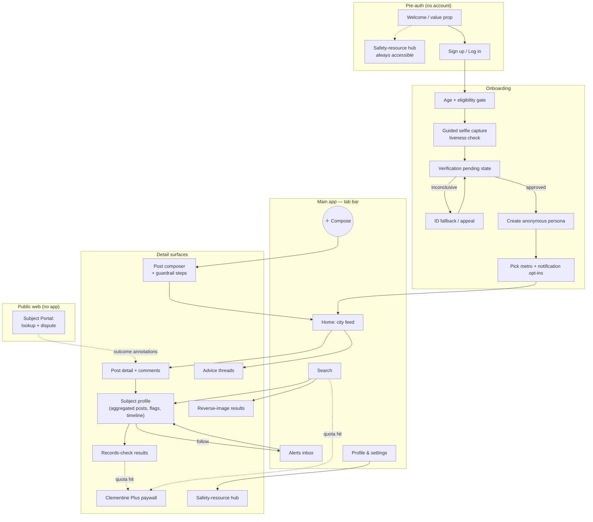
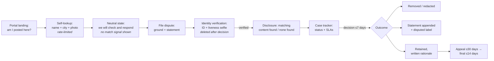

# Clementine — UX Flows & Screens

**Document:** 07-ux-flows.md · **Status:** Draft v1.0 · **Audience:** Design, mobile engineering, T&S
**Related docs:** [01-product-spec.md](01-product-spec.md) · [02-architecture.md](02-architecture.md) · [03-data-model.md](03-data-model.md) · [04-api-design.md](04-api-design.md) · [05-trust-and-safety.md](05-trust-and-safety.md) · [06-security-and-privacy.md](06-security-and-privacy.md) · [08-roadmap.md](08-roadmap.md)

---

## 1. Design principles

1. **Calm under fear.** Members arrive anxious — mid-swipe, pre-first-date, or post-bad-date. Screens minimize choices, use plain language, and never gamify fear (no streaks, no "3 new red flags near you!" engagement bait).
2. **Guardrails are part of the UI, not a police layer.** PII blocking, tone nudges, and flag prompts appear *inside* the composer as helpful structure, so the safe way to post is also the easiest way ([05-trust-and-safety.md](05-trust-and-safety.md) §2).
3. **Honest uncertainty.** "No results" states, records-check caveats, and match-confidence indicators tell the member what the product does *not* know. Overclaiming is a safety defect.
4. **The safety hub is always reachable** — pre-verification, pre-login, and from every crisis-adjacent surface — and never behind the paywall ([01-product-spec.md](01-product-spec.md) §5.1).
5. **Anonymity made visible.** The UI constantly reinforces what others can and cannot see about you (persona-only previews, "visible to members as: 🍊 TangerineDream" chips).

---

## 2. Screen map

Tab bar (5 items): **Home · Search · ＋ · Alerts · You**. DMs (v2) will join as a sixth surface inside Alerts→Messages rather than a new tab, keeping the bar stable.

---

## 3. Key flows

### 3.1 Onboarding with verification

**Goal:** from install to verified member with minimum friction and maximum clarity about what happens to her data.

1. **Welcome (3 cards max).** What Clementine is; "women-only, verified, anonymous to each other"; a persistent link to the safety hub ("need help now?") that requires no account.
2. **Eligibility gate.** 18+ date-of-birth entry, ToS/privacy consent with a human-readable summary ("we never sell your data; your selfie is used once for verification and then deleted").
3. **Guided selfie capture.** One screen: oval face guide, live prompts ("turn your head slowly"), auto-capture on liveness pass. Above the shutter, in the member's line of sight at the moment of capture: **"Used once to verify you're a woman 18+, then deleted. Never shown to anyone."** No gallery upload — camera only ([06-security-and-privacy.md](06-security-and-privacy.md)).
4. **Verification pending.** This is a designed state, not a spinner:
   - Copy: "Reviewing — usually under 2 hours, occasionally up to 24."
   - The member can *browse the safety hub and read the community guidelines* while waiting (guidelines completion is a soft-gated first-post requirement later).
   - She can close the app; a push notification announces the decision.
   - States: `pending → approved`, `pending → needs-ID` (inconclusive: request government ID with the same delete-after-decision promise), `pending → rejected` (with appeal path, handled by human review).
5. **Persona creation.** Pick a display name and avatar from a curated set (no photo uploads for avatars — prevents accidental self-doxxing). A preview chip shows exactly what other members will see. Real name is never collected outside verification.
6. **Metro + notifications.** Choose city (GPS suggestion, manual override), granular notification opt-ins (new-report alerts on, marketing off by default).
7. **Land on the city feed** with a one-time "how posts work here" overlay: red flag / green flag meaning, and the one-line posting rule: *first-person, factual, no addresses or workplaces.*

**Failure paths:** rejected verification shows a kind, non-accusatory screen ("we couldn't verify this time") with the appeal option (ID upload + human review) and a link to the safety hub — a rejected user may still be a woman in danger.

### 3.2 Browsing the local feed

- **Layout:** card list. Each card: flag chip (🚩 red / 🟢 green with text label — never color alone), subject first name + approximate age + neighborhood, one thumbnail, first 2 lines of narrative, comment count, relative timestamp. Poster persona shown small; posts are about subjects, not posters.
- **Filters** (persistent chip row): flag type, neighborhood, recency, "Advice" toggle to swap to the subject-free advice feed.
- **Sorting is recency-first, not engagement-first.** No trending module, no "most commented" — an intentional anti-pile-on choice (§5).
- **Sensitive-content interstitials:** posts tagged (by author or moderation) with assault, stalking, or self-harm-adjacent content render blurred with a label ("Describes sexual violence — tap to read") and a link to relevant hub resources at the bottom of the post.
- **Search caps surfaced gently:** free members see remaining daily searches ("3 of 5 searches left today") in the Search tab only — never as feed nags.

### 3.3 Creating a post (guardrail UX)

The composer is a **4-step structured flow**, not a blank text box. Structure is the defamation-and-doxxing control ([05-trust-and-safety.md](05-trust-and-safety.md) §2.1).

1. **Who.** Subject first name (only), approximate age, neighborhood/city, optional photos. Photo picker copy: "Dating-profile or public social photos only. No photos of him with children, at his home, or showing his workplace." An on-device screen rejects images with detectable faces of minors.
2. **What kind.** Flag selection with concrete category prompts — "Married/partnered," "Aggressive when rejected," "Asked for money," "Not who he says he is," "Green flag: respectful" — plus "Something else." Categories prime specific, factual framing and drive the structured fields in [03-data-model.md](03-data-model.md).
3. **Your experience.** Narrative field with **inline, as-you-type guardrails**:
   - **PII blocking (hard).** Street addresses, phone numbers, emails, employer names, license plates, and social handles are detected client-side and flagged on the offending span with an inline explanation: "Remove his workplace — posts naming employers can't be published. Why?" The Post button stays disabled until resolved. This is a red underline pattern, not a rejection-after-submit pattern.
   - **Tone nudges (soft).** Conclusory or verdict language triggers a dismissible suggestion: *"Consider describing what happened instead — 'On our second date in March, he…' Specific first-person accounts protect you and help other women more."* Nudges never block; they teach.
   - **First-person check.** A required toggle: "This happened to me" vs. "This happened to someone I know" — second-hand reports get an extra caution screen and a visible "second-hand" label on the published post.
4. **Review & publish.** Full preview as others will see it, persona chip ("posting as 🍊 TangerineDream"), one-line legal reminder ("You're responsible for what you post; false posts are removed and may end your membership"), then **"Checking your post…"** — the synchronous screening state (usually seconds). If routed to human review, the post shows in the member's profile as "In review — usually under 30 minutes" and she's notified on publish. Silent shadow states are not used; we always tell the poster her post's status.

### 3.4 Searching a name / photo

1. **Search screen:** three optional inputs — first name, photo (camera or screenshot upload), location (defaults to home metro) — any combination works.
2. **Results:** subject-profile cards (name, age range, neighborhood, flag summary "2 🚩 · 1 🟢", latest-post date). Photo search adds a **match-confidence indicator** (High/Possible) with copy: "Photo matching is imperfect — confirm details before concluding it's the same person."
3. **Subject profile:** aggregated post timeline, flag summary, dispute-outcome annotations where they exist ("The subject disputed this post; moderators upheld it / added his statement"), and three actions: **Follow**, **Run records check** (→ 3.6 paywall path when metered), **Reverse-image check** on his photos.
4. **The empty state is a first-class screen** (§4): "No reports for 'Tom' in Chicago" with explicit honesty about what that means.
5. Every result screen footer: "Use this to inform your own dating decisions only — not for employment, housing, or harassment." (FCRA-scope and misuse guardrail, [05-trust-and-safety.md](05-trust-and-safety.md) §5.)

### 3.5 Receiving and acting on an alert

1. **Push:** deliberately low-detail on the lock screen — "New activity on someone you follow" — never the man's name or the flag type (shoulder-surfing and lock-screen-preview protection).
2. **Alerts inbox:** full detail after auth — "New 🚩 report on Tom (Logan Square) · 2h ago," grouped per subject.
3. **Tapping** opens the subject profile scrolled to the new post, with an **action row tuned to the moment**: *Read the report · Safety planning guide · Run records check · Unfollow.* If the new post is a severe category (violence, stalking), the hub's relevant guide is surfaced inline above the fold.
4. **Acting:** from here she can comment, save, or — if she's currently seeing him — open the safety hub's "ending contact safely" checklist. (v2: start the date check-in timer from this screen.)
5. Alert frequency is capped (digest if >3 events/day on one subject) to avoid alarm fatigue and pile-on dynamics.

### 3.6 Upgrading to Clementine Plus

- **Trigger points, all organic:** 6th search of the day, 3rd reverse-image check of the month, records check beyond the free allowance, 4th follow. The paywall states exactly what ran out and when it resets ("Your 5 free searches reset at midnight").
- **Paywall screen:** single screen, feature table mirroring [01-product-spec.md](01-product-spec.md) §6, monthly/annual toggle (~$14.99/mo · ~$99/yr), one-tap App Store/Play purchase, restore-purchases link.
- **Never paywalled — stated on the paywall itself:** posting, commenting, the safety hub, and dispute rights. Copy: "Sharing and safety basics are always free. Plus funds the lookups that cost us money to run."
- **Post-purchase:** returns the member to the exact interrupted action (the search re-runs automatically).

### 3.7 Subject-side dispute flow (public web portal)

For men who are subjects of posts — **no app install, no account** ([05-trust-and-safety.md](05-trust-and-safety.md) §4). Mobile-first responsive web, indexable, linked from the marketing site and ToS.

UX notes: the portal's tone is procedural and respectful — no adversarial framing, no marketing. The self-lookup **never reveals whether content exists before identity verification succeeds**: pre-verification, every requester sees the same neutral "we'll check and respond" state, so the portal can't be used to probe for reports about an arbitrary name or photo ([05-trust-and-safety.md](05-trust-and-safety.md) §4, [01-product-spec.md](01-product-spec.md) Non-Goal 5); lookups are rate-limited per IP and device. The portal states plainly that verification exists so that *only the person depicted* can dispute (preventing abusers from scrubbing warnings about others or unmasking posters), that verification media is deleted after the match decision, and that **removal is never for sale**. The case tracker is email-plus-token based (no password account) and shows acknowledgment (24 h) and decision (7 days) SLA clocks. Wrong-person disputes ("that's not me") get an expedited lane.

---

## 4. Empty states and content-warning patterns

| Surface | Empty/edge state | Design |
|---|---|---|
| Search results | No reports found | Headline: "No reports for 'Tom' in Chicago." Body: "That means no member here has posted about him — **not** a guarantee he's safe. Trust your instincts." Actions: save this search (alert me if a report appears — Plus), run a records check, read the first-date checklist. |
| New/small metro feed | Few or no posts | "Clementine is new in Boise." Seeded with advice threads and hub content, plus a founding-member prompt ([08-roadmap.md](08-roadmap.md)); never faked activity. |
| Records check | No records found | Same honest framing: jurisdiction gaps, name-match limits, "absence of records is not clearance." |
| Alerts inbox | Nothing yet | "Follow someone from a search to get alerted about new reports." One-line explanation of what triggers alerts. |
| Severe-content posts | Assault/stalking/self-harm mentions | Blur + label interstitial, reader-controlled reveal, hub resources appended; author is prompted to self-tag at compose time, moderators can add tags. |
| Verification pending | Waiting | Progress framing + hub access (§3.1) — the wait is a designed screen, never a dead end. |

---

## 5. Community-tone design: supportive, not pile-on

Anti-brigading is a UI problem as much as a policy problem ([05-trust-and-safety.md](05-trust-and-safety.md) §1.6):

- **No engagement mechanics on subject posts:** no likes, shares, or reposts of red-flag posts; the only counters are comments and "helped me decide" (a private signal to the poster, no public tally).
- **Recency-sorted feeds, no trending, no cross-city virality:** posts do not leave their metro; there is no "hot" tab that could turn one man into a spectacle.
- **Comment composer nudges:** on posts that already have many comments, the composer shows "12 women have already replied — add something new, or just tap 'helped me decide'." Dogpile phrases ("let's find him," "everyone go report his profile") are screened like posts.
- **Supportive defaults:** first-comment placeholder text is "Thank you for sharing / ask a clarifying question…"; reply templates in advice threads lead with validation.
- **Screenshot deterrence:** subject photos render with a faint persona-less watermark and screenshots trigger an in-app reminder that exporting content violates community rules (deterrence + traceability, not DRM theater).
- **Visible fairness:** dispute-outcome annotations and "second-hand" labels appear in-line, teaching the community that accuracy is enforced.

---

## 6. Accessibility

- **WCAG 2.2 AA** target. Full VoiceOver/TalkBack coverage; flag states announced as text ("red flag: safety concern"), never conveyed by color alone (chips carry icons + labels).
- **Contrast:** all text on the citrus palette ≥ 4.5:1; the palette below was chosen with dark-mode variants validated at AA.
- **Dynamic type** to 200% without layout breakage; composer guardrail messages are screen-reader-announced politely (`aria-live="polite"`), PII blocks assertively.
- **Reduced motion:** liveness capture offers a motion-minimal path; no parallax or autoplaying video anywhere.
- **Touch targets ≥ 44 pt**; one-handed reach for the tab bar and primary actions.
- **Trauma-informed patterns:** no red full-screen error flashes, no alarm sounds; content warnings are reader-controlled; crisis-hub entry points use calm language ("need support?" not "EMERGENCY").
- **Plain language:** all legal/safety copy at ~8th-grade reading level; Spanish localization scoped for v1.x.

---

## 7. Visual identity direction

**Warm, ripe, and safe — a kitchen table, not a police station.**

- **Palette:** Clementine Orange `#F27A2C` (primary actions, brand moments) · Zest `#FFB25E` (highlights) · Cream `#FFF6EC` (backgrounds) · Leaf `#3E7C4F` (green flags, success) · Deep Plum `#4A2B3A` (text, dark-mode ground) · alert red reserved *exclusively* for red-flag chips and destructive actions so it never loses meaning.
- **Shape & type:** generous rounded corners, soft shadows, a warm humanist sans (e.g., a Circular/ Recoleta-adjacent pairing) — friendly at body sizes, credible at caption sizes for legal copy.
- **Illustration:** hand-drawn citrus motifs and abstract, diverse figures; no surveillance imagery (crosshairs, magnifying glasses over faces, fingerprints). The search icon is a simple loupe over text, never over a face.
- **Voice:** a knowledgeable friend — direct, validating, unsensational. "Here's what we found" not "UNCOVER THE TRUTH."
- **Dark mode** ships at v1 (plum ground, cream text, oranges desaturated one step) — many members use the app in bed or in a bar bathroom mid-date; brightness is a privacy feature.

---

*Screens and flows here define intended behavior; API contracts live in [04-api-design.md](04-api-design.md), screening logic in [05-trust-and-safety.md](05-trust-and-safety.md), and data-handling promises surfaced in this UI are binding commitments specified in [06-security-and-privacy.md](06-security-and-privacy.md).*
