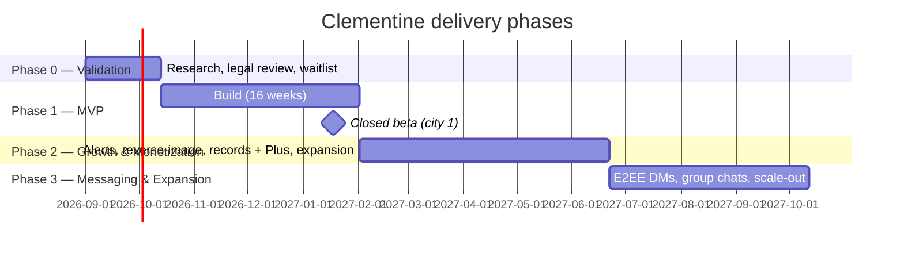

# Clementine — Roadmap & Execution Plan

This document sequences delivery of everything specified in `01-product-spec.md` through `07-ux-flows.md`. It defines the phase gates, the MVP cutline and its rationale, a week-by-week Phase 1 plan, the team and budget, KPIs, launch strategy, and the top-10 risk register. Architecture and security decisions referenced here are specified in `02-architecture.md` and `06-security-and-privacy.md`; trust-and-safety operations are in `05-trust-and-safety.md`.

## Guiding principles

1. **Safety infrastructure ships before growth features.** Moderation tooling, doxxing screening, and the subject-dispute intake (`05-trust-and-safety.md`) are launch blockers, not fast-follows. Tea's history shows the failure mode: viral growth on top of weak controls.
2. **Never store what we can't afford to leak.** Verification media is delete-after-review by default (`06-security-and-privacy.md`). Features that accumulate sensitive data (DMs, background checks) are deferred until the security posture supports them.
3. **Depth in few cities beats thin coverage everywhere.** The product is worthless in a city with no posts, so we launch city-by-city and gate expansion on density metrics.

## Phase overview

---

## Phase 0 — Validation (Weeks −6 to 0)

Goal: confirm demand, de-risk legal exposure, and seed the first city **before writing production code**.

| Workstream | Activities | Exit criteria |
|---|---|---|
| Demand | Landing page + waitlist, 30 user interviews with women 22–38 in candidate launch city, 3 moderated concept tests of the posting flow | ≥5,000 waitlist signups in city 1; ≥70% of interviewees say they'd post, not just lurk |
| Legal | Retain counsel; opinions on Section 230 posture, defamation exposure, FCRA implications of records lookups, GDPR/CCPA duties to non-user subjects (`06-security-and-privacy.md`) | Written legal memo; ToS/privacy policy drafts; dispute-flow requirements signed off |
| Platform risk | Pre-submission conversations via Apple/Google developer relations; study precedent apps (Tea, Garbo, herd-safety apps) for review outcomes | Documented App Review mitigation checklist (see risk R1) |
| Vendors | Select and contract identity-verification vendor (Persona/Veriff-class), moderation-API vendor, push provider; negotiate burst pricing | Signed contracts, sandbox access |
| City selection | Pick city 1 (large single-women population, dense dating-app usage, e.g. Austin/Atlanta-class metro); recruit 20 founding ambassadors | Ambassador cohort committed; 200 seed-content pledges |

Phase 0 is cheap (~$40–60k, mostly legal and founder time) and can kill the project before the expensive part. That is its job.

---

## Phase 1 — MVP (Weeks 1–16)

### The MVP cutline

**In:**

- Women-only signup with selfie-based verification, anonymous persona (`07-ux-flows.md` flow 1)
- City-based local feed; posts about dating experiences with red-flag/green-flag labels
- Search by first name + photo + location returning prior reports
- Pre-publication screening pipeline (doxxing/PII blocker, defamation-risk classifier, human review queue) and the **moderation console**
- Subject notice/dispute intake: a web form (no app install needed) where a man who is the subject of a post can request review, verified via the identity-check flow in `05-trust-and-safety.md`
- Comments on posts
- Community advice threads — the subject-free Advice feed of `01-product-spec.md` §5.1, modeled as posts (`post_type = 'advice'`, `03-data-model.md`) so they ride the same pre-publication screening pipeline
- Safety-resource hub (static content: hotlines, guides)
- Abuse reporting, blocking, account deletion, data-subject request handling

**Out (deferred):** reverse-image search, background-check/public-records lookups, DMs and group chats, push alerts on searched/followed subjects, premium tier.

**Why the line sits here.** The MVP is the smallest product that (a) delivers the core loop — *verify → read local reports → search a name → post an experience* — and (b) is defensible the day it launches. Moderation console and dispute intake are in scope even though users never see them, because operating without them for even one viral week creates legal exposure we cannot unwind (see R2). The deferred items share one of two properties: they multiply data-breach blast radius (DMs were Tea's second breach, ~1.1M messages; background checks aggregate criminal-record data; alerts require storing search history), or they multiply legal surface (FCRA for records lookups, biometric-privacy statutes for reverse-image search). Deferring them lets us launch with a minimal sensitive-data footprint and add each one only after the controls in `06-security-and-privacy.md` for that feature are built and audited. Premium is deferred simply because monetizing before liquidity kills cold cities.

### Week-by-week plan

| Weeks | Engineering | T&S / Ops | Design / Growth |
|---|---|---|---|
| 1–2 | Repo, CI/CD, infra-as-code, staging + prod envs; auth skeleton; core schema from `03-data-model.md` | Draft community guidelines v1 | Design system, verification + onboarding flows |
| 3–4 | Verification-vendor integration; delete-after-review pipeline for selfies (hard requirement before any real user data); anonymous persona creation | Moderation policy: red/green-flag taxonomy, PII blocklist rules | Feed + post-composer designs |
| 5–6 | Posts + flags CRUD, city feed with pagination; image upload with EXIF stripping and private-bucket storage (public-bucket access blocked at the org policy level) | Moderation console v0 (queue, approve/reject, audit log) | Search UX; empty-state designs for cold cities |
| 7–8 | Pre-publication screening pipeline: PII/doxxing regex + ML pass, moderation-API integration, human-review routing per `05-trust-and-safety.md` | Hire/train 2 contract moderators; write reviewer playbook | Ambassador kit; waitlist nurture emails |
| 9–10 | Name+photo+location search with fuzzy matching; comments; advice feed; reporting/blocking | Dispute-intake web form + verified-subject flow; SLA definitions | Beta-onboarding materials |
| 11–12 | Safety-resource hub; account deletion + DSR tooling; rate limiting, abuse throttles | Tabletop exercise: coordinated defamation attack; brigading response drill | App Store assets, review notes emphasizing moderation systems |
| 13 | **Feature freeze.** Penetration test (external firm) focused on storage buckets, auth, IDOR | Moderation load test with synthetic queue | Submit for App Review (expect iterations) |
| 14 | Pen-test remediation; load test at 50× expected launch traffic (Tea-style spike) | Legal sign-off on live policies | Closed beta: 300 ambassadors + waitlist in city 1 |
| 15 | Beta bug-fix; observability dashboards, on-call rotation | Tune screening thresholds on real content | Beta feedback synthesis |
| 16 | **Launch city 1** (waitlist-gated) | 24/7 moderation coverage begins (follow-the-sun contractors) | Launch PR, ambassador push |

A 16-week build with a two-week buffer inside it (weeks 13–15 absorb slippage) is realistic for this team; if verification-vendor integration or App Review drags, cut comments — never cut screening, console, or dispute intake.

---

## Phase 2 — Growth & Monetization (Months 5–9)

Gate to enter: city 1 hits liquidity KPIs (below) and moderation SLAs held for 6 consecutive weeks. This phase delivers the v1.x tier of `01-product-spec.md` §5.2 — intelligence and revenue — in the order 01 specifies: records lookups and Clementine Plus ship *before* DMs, which wait for Phase 3.

- **Reverse-image search** for catfish detection (vendor-backed; biometric-law review completed in Phase 0/1)
- **Push alerts** when a searched/followed subject gets new reports — requires storing per-user search subscriptions, so it ships with the encryption and retention design in `06-security-and-privacy.md`
- **Background-check lookups** (sex-offender registry, criminal, marriage records) via a vetted data vendor, with FCRA-mandated framing (not for employment/tenancy decisions), accuracy disclaimers, and dispute pathway; metered free allowance (1 basic check/month) with the anchor allowance in Clementine Plus (`01-product-spec.md` §6, `07-ux-flows.md` §3.6)
- **Clementine Plus** launches (~$14.99/mo · ~$99/yr, intro pricing tested at launch; `01-product-spec.md` §6): unlimited searches, larger reverse-image and records allowances, unlimited follows + saved-search alerts; free tier keeps core safety features — safety-critical information is never fully paywalled (both an ethical and an App Review position)
- **Richer feed** (topics, following) layered on the MVP's advice threads
- **City expansion:** cohorts of 3–5 cities, each with an ambassador program and 4-week seeded waitlist before open access
- Android store release — single React Native codebase per `02-architecture.md`; if Phase 1 released iOS-first, this is a deliberate staged-release choice (the Android build exists from day one), and the store release may trail iOS by a phase

## Phase 3 — Messaging & Expansion (Months 10–14)

- **DMs and group chats** — shipped last, and only after the E2EE design in `06-security-and-privacy.md` §6 (libsignal for 1:1 DMs, message franking for verifiable abuse reports; MLS for groups) is built and independently audited; this ordering is the direct lesson of Tea's DM leak
- **Date check-in / safety timer** and multi-city expansion tooling (`01-product-spec.md` §5.3)
- Annual plans, referral incentives; explore B2B partnerships (dating platforms, campus-safety orgs)
- **No advertising** — ad tech is incompatible with the anonymity promise

---

## Team plan (4–6 people)

| Role | Count | Notes |
|---|---|---|
| Founder / product lead | 1 | Owns product spec, App Review relationship, fundraising, launch strategy |
| Full-stack engineers | 2 | One leans mobile (React Native with Expo per `02-architecture.md`), one leans backend/infra; both share on-call |
| Security & platform engineer | 1 | Owns storage/encryption posture, verification pipeline, pen-test remediation. **Non-negotiable hire given the threat model** — for most consumer apps this is a luxury; for this one it is the product |
| Trust & Safety lead | 1 | Owns policy, moderation console requirements, dispute SLAs, contractor moderators; hired by week 6 at the latest |
| Designer / community (hire #6) | 1 | Product design plus ambassador program; fractional until Phase 1 midpoint |

Contract/fractional: general counsel (retainer), 2–4 contract moderators scaling with volume, fractional data engineer in Phase 3.

## Budget (first 12 months, rough)

| Category | Estimate | Notes |
|---|---|---|
| Team (5.5 FTE avg, loaded) | $1.05M–$1.35M | $160–220k loaded per FTE |
| Contract moderation | $90k–$150k | 2 FTE-equiv scaling to 4; follow-the-sun |
| Legal | $80k–$150k | Formation, policies, defamation counsel, FCRA/GDPR advice, dispute escalations |
| Identity verification vendor | $50k–$120k | ~$1–2 per verification; volume-dependent |
| Moderation APIs / ML | $25k–$60k | Text + image screening per post |
| Cloud infra | $40k–$100k | Modest baseline; reserve headroom + rate-limit design for viral spikes (`02-architecture.md`) |
| Security (pen tests, audits, tooling) | $60k–$90k | Two external tests year 1 + bug bounty pilot |
| Insurance (cyber + media liability) | $40k–$80k | Media-liability coverage is unusual for apps but essential here |
| Marketing / ambassadors | $60k–$100k | Stipends, events, launch PR |
| **Total year 1** | **≈ $1.5M–$2.2M** | Implies a seed raise of $2.5–3M for 18 months' runway |

## KPIs by phase

| Phase | North-star & guardrail metrics |
|---|---|
| 0 | Waitlist signups (≥5k city 1); interview intent-to-post ≥70% |
| 1 (launch → month 2) | Verified activation ≥60% of signups; **≥30% of WAUs create or meaningfully engage with a post** (liquidity); searches returning ≥1 result ≥25%; D30 retention ≥25%. Guardrails: median moderation decision <2h, dispute first-response <24h, %posts removed post-publication <3% (screening is working), zero PII leaks to production feed |
| 2 | City-cohort liquidity within 6 weeks of open access; alert opt-in ≥40% of searchers; free→Plus conversion 4–8%; K-factor ≥0.4 from invites |
| 3 | DM breach-drill pass (ciphertext-only yield verified); Plus monthly churn <6%; LTV:CAC >3; revenue covering moderation + infra opex by month 14 |

## Launch strategy

**City-by-city seeding, Tea-style, but gated.** One city at a time until the playbook is proven:

1. **Waitlist per city.** Nobody enters an empty room — a city opens only when its waitlist passes ~5k and seed content passes ~500 approved posts. Position in line is improved by referring other women (viral loop that respects the women-only gate: referrals still pass verification).
2. **Ambassador model.** 20–30 founding members per city — women active in local communities (group-chat admins, campus orgs, service-industry networks). They get early access, direct line to the team, small stipends, and input on features. Their job: seed authentic posts in week 1 and set community tone.
3. **Earned media over paid.** The category is inherently newsworthy; a safety-first narrative ("here's how we're different from Tea on security and fairness") is the story we pitch. Paid acquisition waits until Phase 3.
4. **Burst readiness.** Tea went from obscurity to #1 on the App Store in days. Every launch assumes it might go viral: infra load-tested at 50×, verification vendor pre-cleared for volume spikes, waitlist as the pressure-release valve (we throttle admissions rather than degrade verification or moderation quality), moderator surge bench on call.

## Top-10 risk register

| # | Risk | Likelihood | Impact | Mitigation |
|---|---|---|---|---|
| R1 | **App Store / Play Store rejection or removal** — UGC about identifiable private individuals sits close to Apple 1.2 (objectionable UGC) and harassment policies | High | Critical | Phase 0 pre-engagement with review teams; submission notes documenting screening, moderation SLAs, dispute flow; visible in-app reporting; keep a PWA fallback so the community survives a takedown window; never market as a "gossip" app |
| R2 | **Defamation / legal action from post subjects** | High | Critical | Section 230 posture preserved (no editorializing of user posts); pre-publication PII screening; fast notice/takedown/appeal with verified-subject dispute flow (`05-trust-and-safety.md`); media-liability insurance; counsel on retainer; jurisdiction-aware ToS |
| R3 | **Data breach of verification media or DMs** (Tea's exact failure) | Medium | Critical | Delete-after-review for selfies/IDs; no public buckets, enforced by org-level cloud policy + CI checks; DMs deferred until breach-assuming design ships; pen tests before launch and before each sensitive feature; incident-response runbook (`06-security-and-privacy.md`) |
| R4 | **Cold-start / network-effect failure** — empty feeds and empty search results kill retention | High | High | City gating on waitlist + seed-content thresholds; ambassadors; search empty-states that still deliver value (safety-check guides, resource hub); expansion only after city 1 liquidity proven |
| R5 | **Verification failure modes** — false rejections (excluding trans women, accessibility issues) or false accepts (men infiltrating) | Medium | High | Vendor with documented inclusive-verification performance; human appeal path for rejections; layered signals beyond one selfie; infiltration red-team tests each quarter |
| R6 | **Moderation quality collapse under viral load** | Medium | High | Waitlist throttle as load valve; surge moderator bench; automation triage tiers; hard rule that admission rate never exceeds review capacity |
| R7 | **Coordinated abuse** — brigading, false reports targeting an innocent man, or men's-rights retaliation campaigns | Medium | High | Rate limits, duplicate/coordination detection, provenance signals on posts; dispute flow doubles as correction mechanism; tabletop drills (week 11) |
| R8 | **Regulatory action** — GDPR/CCPA rights of non-user subjects, FCRA if background checks are misframed, state biometric statutes | Medium | High | Non-user DSR process from day 1; background checks vendor-mediated with FCRA-compliant framing and geographic gating; biometric-law review before reverse-image launch |
| R9 | **Payment/platform dependency** — Apple's 30% cut and IAP rules squeeze premium margins | Medium | Medium | Price with the cut modeled in; web-based subscription management where policy allows; annual plans |
| R10 | **Burnout / key-person risk in a 5-person team running 24/7 T&S** | Medium | Medium | Contract moderation absorbs the always-on load; enforced on-call rotation; T&S lead owns escalation so engineers aren't adjudicating content; document everything (this plan, runbooks) |

## Phase gates (summary)

- **Phase 0 → 1:** legal memo signed, vendors contracted, 5k waitlist, ambassadors committed.
- **Phase 1 → launch:** pen test passed, screening pipeline live, dispute intake live, App Review approved, moderation coverage staffed.
- **Phase 1 → 2:** city 1 liquidity + 6 weeks of moderation SLA compliance.
- **Phase 2 → 3:** 3+ liquid cities, Clementine Plus conversion in target band, E2EE DM design (`06-security-and-privacy.md` §6) audited, alert infrastructure stable.

Each gate is a stop-the-line check: growth never outruns safety capacity. That discipline is the difference between Clementine and the cautionary tale it is designed to improve on.
